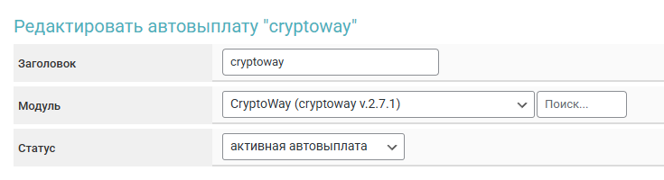
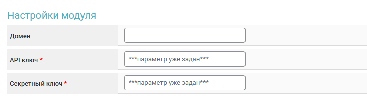
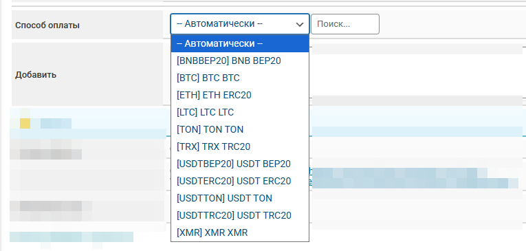

# CryptoWay


<mark style="color:red;">Перед настройкой автовыплат обязательно прочитайте</mark> [<mark style="color:red;">предупреждение о рисках!</mark>](https://premium.gitbook.io/main/osnovnye-nastroiki/merchanty-i-avtovyplaty/avtovyplaty/preduprezhdenie-o-riskakh)



Если вам необходимо обновить модуль на сервере — воспользуйтесь [инструкцией](https://premium.gitbook.io/main/osnovnye-nastroiki/faq/obnovlenie-failov-skripta-na-servere/kak-obnovit-faily-na-servere#moduli-merchantov-i-avtovyplat)


## Настройки в личном кабинете мерчанта


**Дисклеймер**: при подключении вашего сайта к тому или иному сервису, пожалуйста, самостоятельно оценивайте возможные риски сотрудничества.


Зарегистрируйтесь на [сервисе CryptoWay](https://cryptoway.com/ru) и авторизуйтесь в личном кабинете.

Перейдите в раздел с API ключами. Выпустите набор ключей по кнопке "Create API Key".

<figure><figcaption></figcaption></figure>

Укажите произвольное имя для набора таких ключей и IP вашего сервера (опционально) в соответствующих полях.

#### Установите галочки прав для создаваемой пары ключей:

**Withdrawal —** для модуля автовыплаты. Права на вывод средств.

**Deposits —** для модуля мерчанта. Права на приём средств.

<figure><figcaption></figcaption></figure>

Подтвержите создание ключей указан код отправленный на почту регистрации.

Скопируйте полученные **Key ID** и **Key Secret** в буфер обмена или текстовый файл.

<figure><figcaption></figcaption></figure>

Ключит доступны для просмотра только при создании, повторно скопировать или просмотреть их не получится. Нужно будет создавать новую пару ключей.

## Настройки модуля

В панели администратора создайте нового мерчанта в разделе "**Мерчанты**" ➔ "**Добавить автовыплату".**

Выберите модуль **CryptoWay** в выпадающем списке в поле "**Модуль**", укажите название для модуля и нажмите "**Сохранить**".

<figure><figcaption></figcaption></figure>

Заполните указанные авторизационные поля.

<figure><figcaption></figcaption></figure>

**Домен** — не заполняйте поле, оставьте его пустым.

**API ключ** — Key ID, скопированный ранее в ЛК CryptoWay.

**Секретный ключ** — Key Secret,скопированный ранее в ЛК CryptoWay.

## Особые поля

Способ оплаты — выбор валюты для выдачи адреса кошелька (при выборе пункта "**Автоматически**" будет использоваться XML код валюты "**Отдаю**")

* **добавить** — добавление своего кода валюты

<figure><figcaption></figcaption></figure>

**Cron-файл -** [создайте задание](https://premium.gitbook.io/main/osnovnye-nastroiki/faq/kak-sozdat-zadanie-cron-na-servere) с такой ссылкой на сервер&#x435;**.**

## Продолжение настройки

Дополнительные настройки модуля выполняются согласно [общей инструкции по настройке](https://premium.gitbook.io/rukovodstvo-polzovatelya/osnovnye-nastroiki/merchanty-i-avtovyplaty/merchanty/obshie-nastroiki-merchantov).
