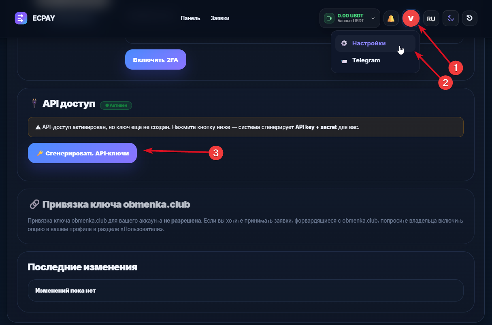
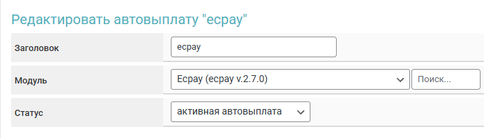
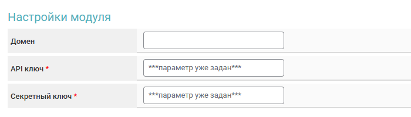
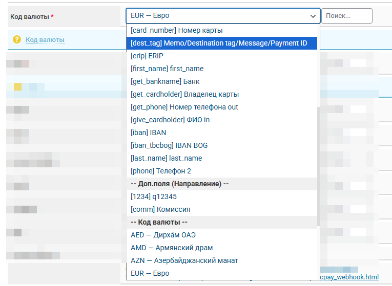
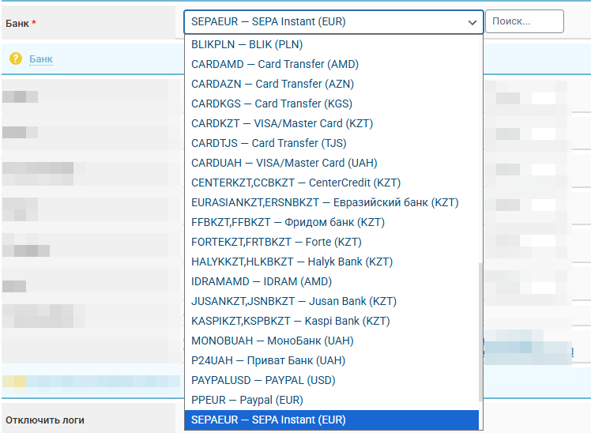
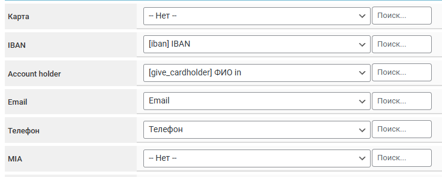
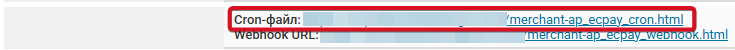

# Ecpay.System


Перед настройкой автовыплат обязательно прочитайте [предупреждение о рисках!](https://premium.gitbook.io/main/osnovnye-nastroiki/merchanty-i-avtovyplaty/avtovyplaty/preduprezhdenie-o-riskakh)



Если вам необходимо обновить модуль на сервере — воспользуйтесь [инструкцией](https://premium.gitbook.io/main/osnovnye-nastroiki/faq/obnovlenie-failov-skripta-na-servere/kak-obnovit-faily-na-servere#moduli-merchantov-i-avtovyplat)



Для обсуждения условий и подключения свяжитесь с представителем сервиса - [https://t.me/ECPAYSystem](https://t.me/ECPAYSystem)

**Дисклеймер**: при подключении вашего сайта к тому или иному сервису, пожалуйста, самостоятельно оценивайте возможные риски сотрудничества.


Пройдите процес подключения и авторизуйтесь на сайте [https://ecpay.systems](https://ecpay.systems). \
\
Сгенерируйте API-ключи в настройках аккаунта

<figure><figcaption></figcaption></figure>

Скопируйте полученную пару ключей для указания в настройках модуля в системе.

<figure><figcaption></figcaption></figure>

## Настройки модуля

В панели администратора создайте нового мерчанта в разделе "**Мерчанты**" ➔ "**Добавить автовыплату".**

<figure><figcaption></figcaption></figure>

Выберите Ecpay в выпадающем списке в поле "**Модуль**", укажите название для модуля и нажмите "**Сохранить".**

Заполните указанные авторизационные поля.

<figure><figcaption></figcaption></figure>

**Домен** — не заполняйте поле, оставьте его пустым.

**API ключ — API key** на сервисе Ecpay

**Секретный ключ —  API secret** на сервисе Ecpay

## Особые поля

<figure><figcaption></figcaption></figure>

**Код валюты —** выберите подходящую валюту или укажите поле, из которого обозначение для валюты будет использоваться.

<figure><figcaption></figcaption></figure>

**Банк** — выберите подходящий к валюте банк из списка или укажите поле, из которого обозначение для банка будет использоваться.


## Дополнительные поля для заявки

При выплате средств с использованием автовыплаты Ecpay.System часто **необходимо** добавить дополнительные поля в форму обмена для заполнения клиентом при создании заявки.

Для этого создайте и добавьте [дополнительные поля](https://premium.gitbook.io/rukovodstvo-polzovatelya/osnovnye-nastroiki/valyuty-i-napravleniya/dobavlenie-novoi-valyuty#vkladka-dop.-polya) к соответствующим валютам для выплаты средств через Ecpay.System.

В настройках модуля поля для определённых параметров можно указать явно. В случае, где для работы с валютой потребуется такое поле - будут использоваться указанные настройки. 


<figure><figcaption></figcaption></figure>

**Карта —** обычно используется стандартное поле "На счёт", но можно выбрать другое при необходимости

**IBAN —** создаваемое дополнительное поле валюты.

**Account holder —** создаваемое дополнительное поле валюты с запросом информации о держателе карты.

**Email —** обычно стандартное системное поле "Email".

**Телефон —** обычно стандартное системное поле "Телефон".

**MIA—** создаваемое дополнительное поле валюты.

<figure><figcaption></figcaption></figure>

**Cron-файл -** [создайте задание](https://premium.gitbook.io/main/osnovnye-nastroiki/faq/kak-sozdat-zadanie-cron-na-servere) с такой ссылкой на сервер&#x435;**.**

## Продолжение настройки 

Дополнительные настройки модуля выполняются согласно [общей инструкции по настройке](https://premium.gitbook.io/rukovodstvo-polzovatelya/osnovnye-nastroiki/merchanty-i-avtovyplaty/avtovyplaty/obshie-nastroiki-merchantov-avtovyplat).
