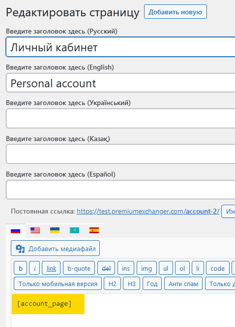

# Finora


Перед настройкой автовыплат обязательно прочитайте [предупреждение о рисках!](https://premium.gitbook.io/main/osnovnye-nastroiki/merchanty-i-avtovyplaty/avtovyplaty/preduprezhdenie-o-riskakh)



Если вам необходимо обновить модуль на сервере — воспользуйтесь [инструкцией](https://premium.gitbook.io/main/osnovnye-nastroiki/faq/obnovlenie-failov-skripta-na-servere/kak-obnovit-faily-na-servere#moduli-merchantov-i-avtovyplat)



Для обсуждения условий и подключения свяжитесь с представителем сервиса.

**Дисклеймер**: при подключении вашего сайта к тому или иному сервису, пожалуйста, самостоятельно оценивайте возможные риски сотрудничества.


## Настройки модуля

В панели администратора создайте нового мерчанта в разделе "**Мерчанты**" ➔ "**Добавить автовыплату".**

Выберите Finora в выпадающем списке в поле "**Модуль**", укажите название для модуля и нажмите "**Сохранить**".

<figure><figcaption></figcaption></figure>

Заполните указанные авторизационные поля.

<figure><figcaption></figcaption></figure>

**Логин (ЛК)** — логин от вашего ЛК в Finora

**OTP ключ (ЛК)** — OTP-ключ от вашего ЛК в Finora

**Логин (SSO выплата)** — логин от сервиса в Finora

**OTP ключ (SSO выплата)** — OTP-ключ от сервиса в Finora

**Приватный ключ** — приватный ключ, переданный вам менеджером Finora

## Особые поля

<figure><figcaption></figcaption></figure>

**Способ оплаты** — выберите подходящий метод из списка

## Продолжение настройки 

Далее произведите настройку мерчанта следуя [общей инструкции по настройке](https://premium.gitbook.io/rukovodstvo-polzovatelya/osnovnye-nastroiki/merchanty-i-avtovyplaty/avtovyplaty/obshie-nastroiki-merchantov-avtovyplat).
