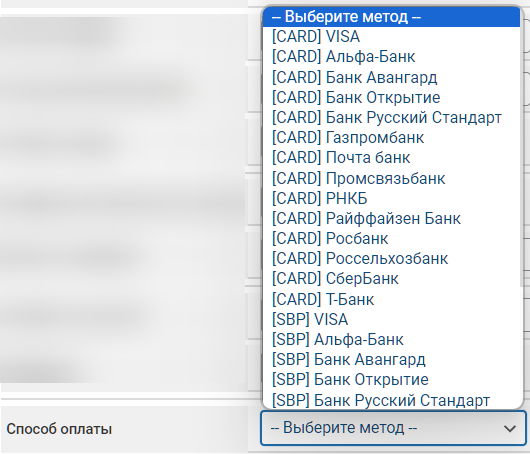

# Ivanpay


<mark style="color:red;">Перед настройкой автовыплат обязательно прочитайте</mark> [<mark style="color:blue;">предупреждение о рисках</mark>](https://premium.gitbook.io/main/osnovnye-nastroiki/merchanty-i-avtovyplaty/avtovyplaty/preduprezhdenie-o-riskakh)<mark style="color:blue;">!</mark>



Если вам необходимо обновить модуль на сервере — воспользуйтесь [инструкцией](https://premium.gitbook.io/rukovodstvo-polzovatelya/osnovnye-nastroiki/faq/kak-obnovit-faily-na-servere#moduli-avtovyplat)


## Настройки в личном кабинете мерчанта 


Для обсуждения условий и подключения, свяжитесь с [представителем сервиса](https://t.me/IvanPay_pro).

**Дисклеймер**: при подключении вашего сайта к тому или иному сервису, самостоятельно пожалуйста оценивайте возможные риски сотрудничества.


Пройдите регистрацию на сервисе [IvanPay](https://ivanpay.com/).

<figure><figcaption></figcaption></figure>

В личном кабинете мерчанта скопируйте данные из поля "**Ваш API-адрес**", а также API-ключ, выданный вам представителем сервиса.

<figure><figcaption></figcaption></figure>

## Настройки модуля 

В панели администратора создайте нового мерчанта в разделе "**Автовыплаты**" -> "**Добавить автовыплату".**

Выберите Ivanpay в выпадающем списке в поле "**Модуль**", укажите название для модуля и нажмите "**Сохранить**".

<figure><figcaption></figcaption></figure>

Заполните указанные авторизационные поля.

<figure><figcaption></figcaption></figure>

**Домен** — домен мерчанта, ранее скопированный в ЛК мерчанта из поля "**Ваш API-адрес**"

**API ключ** — **Ключ API**, переданный вам менеджером Ivanpay

## Особые поля

<figure><figcaption></figcaption></figure>

<figure><figcaption></figcaption></figure>

**Способ оплаты** — выберите необходимый способ для выплаты средств


Обратите внимание на особенность сервиса Ivanpay — **по возможности** выплата производится с карты банка, выбранного вами в настройках модуля, но при отсутствии карт выбранного банка выплата производится с карты другого банка, которая в данный момент имеется на сервисе (метод при этом не меняется и остается исходным — CARD или SBP)


При использовании метода **\[SBP] СБП** (без указания банка) необходимо передавать мерчанту название банка, которое будет выбирать клиент в форме обмена.

Для этого создайте новое дополнительное поле в разделе "**Валюты**" -> "**Доп. поля валют**" и настройте его согласно скриншоту ниже:

<figure><figcaption></figcaption></figure>

Перечень банков, указываемых в поле "**Варианты**" для разных языковых версий:



Альфа-Банк

СберБанк

Т-Банк

РНКБ

Открытие

Русский Стандарт

Авангард

Райффайзен

Газпромбанк

Почта банк

Россельхозбанк

РОСБАНК

Промсвязьбанк

МТС Банк

Совкомбанк

Банк Уралсиб

ОТП банк

ВТБ

Ак Барс Банк

Ozon Банк

Банк УБРиР

Экспобанк

Банк ЗЕНИТ

Примсоцбанк

ЮниКредит Банк

АО КБ ЮНИСТРИМ

Яндекс Банк

Банк Левобережный



Alfa-Bank

SberBank

T-Bank Bank

RNCB Bank

Otkritie

Russian Standart

Bank AVANGARD

Raiffeisenbank

Gazprombank

Pochta Bank

Rosselkhozbank

ROSBANK

Promsvyazbank

MTS Bank

Sovcombank

Bank Uralsib OTP

Bank VTB

Bank AK BARS

Bank OZON

Bank UBRD - Ural

Bank Expobank

Bank ZENIT

Primsotsbank

UniCredit Bank

UNISTREAM COMMERCIAL BANK

Yandex Bank

Bank Levoberezhny



После этого добавьте доп. поле для валюты, выбранной для выплаты в этом направлении обмена, в настройках самого поля:

<figure><figcaption></figcaption></figure>

Или в настройках валюты на вкладке "**Доп. поля**":

<figure><figcaption></figcaption></figure>

Cохраните изменения.

После этого поле будет отображаться в форме обмена и клиенту будет необходимо выбрать один из вариантов при создании заявки.

<figure><figcaption></figcaption></figure>

## Продолжение настройки

Далее произведите настройку мерчанта следуя [общей инструкции по настройке](https://premium.gitbook.io/rukovodstvo-polzovatelya/osnovnye-nastroiki/merchanty-i-avtovyplaty/avtovyplaty/obshie-nastroiki-merchantov-avtovyplat).
