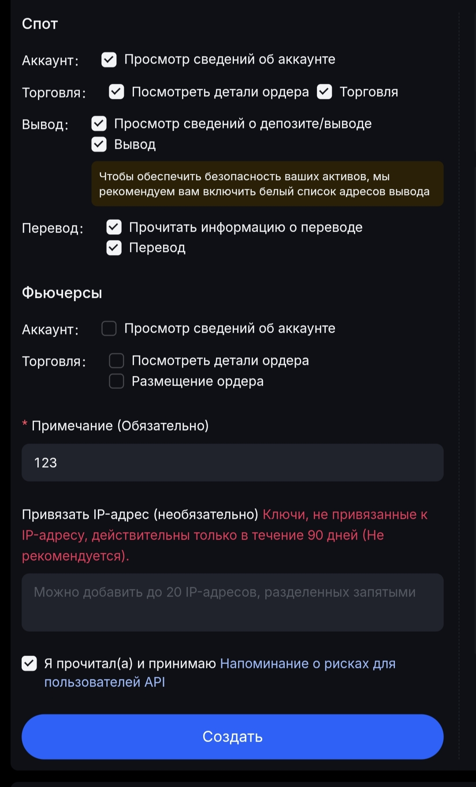

# MEXC


<mark style="color:red;">Перед настройкой автовыплат обязательно прочитайте</mark> [<mark style="color:blue;">предупреждение о рисках!</mark>](https://premium.gitbook.io/main/osnovnye-nastroiki/merchanty-i-avtovyplaty/avtovyplaty/preduprezhdenie-o-riskakh)



Если вам необходимо обновить модуль на сервере — воспользуйтесь [инструкцией](https://premium.gitbook.io/main/osnovnye-nastroiki/faq/obnovlenie-failov-skripta-na-servere/kak-obnovit-faily-na-servere#moduli-merchantov-i-avtovyplat)


## Настройки в личном кабинете мерчанта


**Дисклеймер**: при подключении вашего сайта к тому или иному сервису, пожалуйста, самостоятельно оценивайте возможные риски сотрудничества.


[Зарегистрируйтесь на бирже MEXC](https://www.mexc.com/ru-RU/register), авторизуйтесь в личном кабинете и перейдите в раздел "**Управление API**".

<figure><figcaption></figcaption></figure>

Выпустите API-ключи с правами доступа, отмеченными на скриншоте.

<figure><figcaption></figcaption></figure>

Пройдите проверку безопасности при выпуске ключей.

<figure><figcaption></figcaption></figure>

Скопируйте выпущенные ключи в буфер обмена или в текстовый файл.

<figure><figcaption></figcaption></figure>

## Настройки модуля

В панели администратора создайте нового мерчанта в разделе "**Мерчанты**" ➔ "**Добавить автовыплату".**

Выберите MEXC в выпадающем списке в поле "**Модуль**", укажите название для модуля и нажмите "**Сохранить**".

<figure><figcaption></figcaption></figure>

Заполните указанные авторизационные поля.

<figure><figcaption></figcaption></figure>

**Домен** — оставьте поле пустым

**API ключ** — Access Key, скопированный ранее в ЛК MEXC

**Секретный ключ** — Secret Key, скопированный ранее в ЛК MEXC

## Особые поля

<figure><figcaption></figcaption></figure>

**Способ оплаты** — выбор криптовалюты для автовыплаты

* **Добавить** — добавление своего кода валюты

## Продолжение настройки

Далее произведите настройку мерчанта следуя [общей инструкции по настройке](https://premium.gitbook.io/rukovodstvo-polzovatelya/osnovnye-nastroiki/merchanty-i-avtovyplaty/merchanty/obshie-nastroiki-merchantov). 
