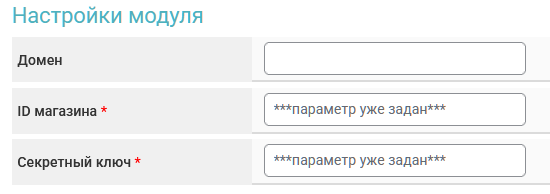

# Paycore


Перед настройкой автовыплат обязательно прочитайте [предупреждение о рисках!](https://premium.gitbook.io/main/osnovnye-nastroiki/merchanty-i-avtovyplaty/avtovyplaty/preduprezhdenie-o-riskakh)



Если вам необходимо обновить модуль на сервере — воспользуйтесь [инструкцией](https://premium.gitbook.io/main/osnovnye-nastroiki/faq/obnovlenie-failov-skripta-na-servere/kak-obnovit-faily-na-servere#moduli-merchantov-i-avtovyplat)


## Настройки в личном кабинете мерчанта


Для обсуждения условий и подключения, свяжитесь с [представителем сервиса](https://t.me/Paycore_pw).

**Дисклеймер**: при подключении вашего сайта к тому или иному сервису, пожалуйста, самостоятельно оценивайте возможные риски сотрудничества.


После получения реквизитов для входа от [представителя сервиса](https://t.me/Paycore_pw), авторизуйтесь в
&#x20;[ЛК PayCore](https://paycore.pw/admin) и пройдите верификацию.
\
После прохождения верификации запросите у представителя сервиса API-ключ
&#x20;для подключения.

## Настройки модуля

В панели администратора создайте нового мерчанта в разделе "**Мерчанты**" ➔ "**Добавить автовыплату".**

Выберите Paycore в выпадающем списке в поле "**Модуль**", укажите название для модуля и нажмите "**Сохранить**".

<figure><figcaption></figcaption></figure>

Заполните указанные авторизационные поля.

<figure><figcaption></figcaption></figure>

**Домен** — оставьте поле пустым

**API ключ** — API ключ, выданный вам представителем Paycore

## Особые поля

В инструкции в модуле автовыплаты обязательно добавьте шорткод "**Ссылка на оплату**" — это необходимо для отображения ссылки в заявке, по которой будет переходить клиент для выбора метода получения им средств и банка на платежной странице сервиса.

<figure><figcaption></figcaption></figure>

После этого вставьте следующий блок текста в поле:

```html
<h2>Текст</h2>
<br>
<div style="text-align: center;">
<a href="{tx_url}" target="_blank" class="btn-new">Перейти к
подтверждению</a>
</div>
[else]
<h2>Текст</h2>
```

и скорректируйте текст, используя первый шорткод, чтобы в итоге получился формат:

```html
[if_url_xxxxxxxxxxxxxxxxxxxxxxxxxxxxx]
<h2>Ваш текст</h2>
<br>
<div style="text-align: center;">
<a href="{tx_url}" target="_blank" class="btn-new">Перейти к
подтверждению</a>
</div>
[else]
<h2>Текст</h2>
[/if_url_xxxxxxxxxxxxxxxxxxxxxxxxxxxxx]
```

<figure><figcaption><p>Отображение вышеуказанного шаблона на странице заявки</p></figcaption></figure>

Также обязательно отметьте статус "**Ожидание подтверждения от модуля автовыплат**" в разделе "**Настройки обменника**" ➔ "**Настройки статуса**" — это необходимо для корректной работы модуля автовыплаты (если раздел не отображается в боковой панели — активируйте модуль "**Профессиональная настройка статусов**" в разделе "**Модули**", а затем проведите указанную настройку).

<figure><figcaption></figcaption></figure>

## Продолжение настройки

Далее произведите настройку мерчанта следуя [общей инструкции по настройке](https://premium.gitbook.io/rukovodstvo-polzovatelya/osnovnye-nastroiki/merchanty-i-avtovyplaty/merchanty/obshie-nastroiki-merchantov).<br>
