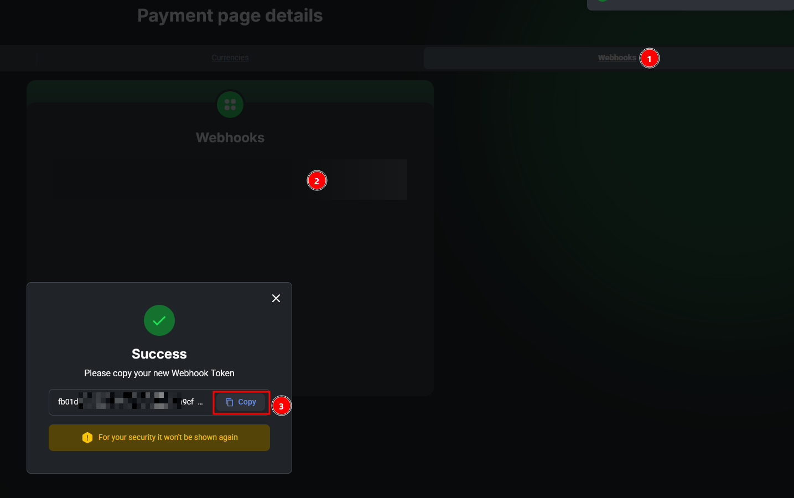

# PayPlay


<mark style="color:red;">Перед настройкой автовыплат обязательно прочитайте</mark> [<mark style="color:blue;">предупреждение о рисках</mark>](https://premium.gitbook.io/main/osnovnye-nastroiki/merchanty-i-avtovyplaty/avtovyplaty/preduprezhdenie-o-riskakh)<mark style="color:blue;">!</mark>



Если вам необходимо обновить модуль на сервере — воспользуйтесь [инструкцией](https://premium.gitbook.io/main/osnovnye-nastroiki/faq/obnovlenie-failov-skripta-na-servere/kak-obnovit-faily-na-servere#moduli-merchantov-i-avtovyplat)


## Настройки в личном кабинете мерчанта


Для обсуждения условий и подключения, свяжитесь с [представителем сервиса](https://t.me/am_payplay).

**Дисклеймер**: при подключении вашего сайта к тому или иному сервису, пожалуйста, самостоятельно оценивайте возможные риски сотрудничества.


Зарегистрируйтесь на сервисе PayPlay с помощью представителя сервиса и авторизуйтесь в личном кабинете мерчанта.

## Настройки модуля

В панели администратора создайте нового мерчанта в разделе "**Автовыплаты**" ➔ "**Добавить автовыплату".**

Выберите PayPlay в выпадающем списке в поле "**Модуль**", укажите название для модуля и нажмите "**Сохранить**".

<figure><figcaption></figcaption></figure>

Заполните указанные авторизационные поля.

<figure><figcaption></figcaption></figure>

**Домен** — оставьте поле пустым

**API ключ** — API ключ, отображаемый в настройках ЛК PayPlay

<figure><figcaption></figcaption></figure>

**Slug** — ID платежной страницы, отображаемый в ЛК PayPlay

<figure><figcaption></figcaption></figure>

Обратите внимание, что для модуля автовыплаты необходимо указывать ссылку для вебхука для корректной проверки выплаты по заявке. Скопируйте ссылку в настройках модуля автовыплаты

<figure><figcaption></figcaption></figure>

и вставьте её в указанное на скриншоте ниже поле в настройках ЛК PayPlay

<figure><figcaption></figcaption></figure>

После сохранения вебхука обязательно выберите методы для работы с ним и сохраните изменения.

<figure><figcaption></figcaption></figure>

## Особые поля

<figure><figcaption></figcaption></figure>

**Код валюты** — выберите необходимый способ для выплаты средств клиенту

* **Доп. поля** — использование кода валюты, указанного в [доп.поле](https://premium.gitbook.io/main/osnovnye-nastroiki/valyuty-i-napravleniya-obmena/dopolnitelnye-polya#dopolnitelnye-polya-dlya-valyuty) для валюты "**Получаю**" или в направлении обмена или [доп.поля для направления обмена](https://premium.gitbook.io/main/osnovnye-nastroiki/valyuty-i-napravleniya-obmena/dopolnitelnye-polya#dopolnitelnye-polya-dlya-napravleniya-obmena)
* **Коды валют** — выбор кода валюты вручную (в этом случае модуль будет работать только с указанной валютой)

<figure><figcaption></figcaption></figure>

**Сеть** — выберите подходящую сеть для валюты выплаты

* **Доп. поля** — использование кода валюты, указанного в [доп.поле](https://premium.gitbook.io/main/osnovnye-nastroiki/valyuty-i-napravleniya-obmena/dopolnitelnye-polya#dopolnitelnye-polya-dlya-valyuty) для валюты "**Получаю**" или в направлении обмена или [доп.поля для направления обмена](https://premium.gitbook.io/main/osnovnye-nastroiki/valyuty-i-napravleniya-obmena/dopolnitelnye-polya#dopolnitelnye-polya-dlya-napravleniya-obmena)
* **Коды валют** — выбор кода валюты вручную (в этом случае модуль будет работать только с указанной валютой)

## Продолжение настройки

Далее произведите настройку мерчанта следуя [общей инструкции по настройке](https://premium.gitbook.io/rukovodstvo-polzovatelya/osnovnye-nastroiki/merchanty-i-avtovyplaty/avtovyplaty/obshie-nastroiki-merchantov-avtovyplat). 
