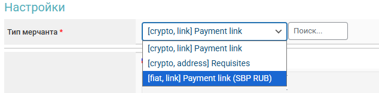
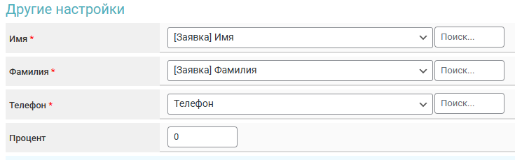

# 2328


Если вам необходимо обновить модуль на сервере — воспользуйтесь [инструкцией](https://premium.gitbook.io/main/osnovnye-nastroiki/faq/obnovlenie-failov-skripta-na-servere/kak-obnovit-faily-na-servere#moduli-merchantov-i-avtovyplat)


## Настройки в личном кабинете мерчанта


Для обсуждения условий работы свяжитесь с [представителем сервиса](https://t.me/Partners2328).

**Дисклеймер**: при подключении вашего сайта к тому или иному сервису, пожалуйста, самостоятельно оценивайте возможные риски сотрудничества.


Зарегистрируйтесь на [сервисе 2328.io](https://my.2328.io/ru/register) и авторизуйтесь в личном кабинете мерчанта. Создайте новый проект в разделе "**Проекты**". Заполните в открывшемся окне требуемые поля, отправьте заявку на рассмотрение и ожидайте смены статуса с "**На модерации**" на "**Активен**".

<figure><figcaption></figcaption></figure>

После активации проекта перейдите в его настройки и скопируйте выделенные ключи.

<figure><figcaption></figcaption></figure>

## Настройки модуля

В панели администратора создайте нового мерчанта в разделе "**Мерчанты**" ➔ "**Добавить мерчант".**

Выберите 2328 в выпадающем списке в поле "**Модуль**", укажите название для модуля и нажмите "**Сохранить**".

<figure><figcaption></figcaption></figure>

Заполните указанные авторизационные поля.

<figure><figcaption></figcaption></figure>

**Домен** — оставьте поле пустым

**Project ID** — ID, скопированный ранее в ЛК 2328

**Payment API Key** — ключ, скопированный ранее в ЛК 2328

## Тип мерчанта

<figure><figcaption></figcaption></figure>

В настройках модуля доступно три варианта работы:

**Payment link** **—** в заявке будет выводиться кнопка для перехода на страницу оплаты мерчанта.

**Requisites —** в заявку будут передаваться реквизиты на оплату, например номер кошелька.

**Payment link (SBP RUB) —** кнопка в заявке для перехода на страницу оплаты с QR-кодом, приём RUB по СБП.&#x20;

Выбранный тип мерчанта сохраняется **для этой копии модуля**, изменить его не получится.\
Для выбора другого типа мерчанта нужно создать отдельную копию модуля мерчанта.

## Особые поля




<figure><figcaption></figcaption></figure> <figure><figcaption></figcaption></figure>

**Код валюты** (для подбора реквизитов)**:**

* **Доп. поля (Заявка)** — использование кода валюты из заявки (выберите **\[Отдаете] Код валюты**)
* **Доп. поля (Валюты)** — использование [доп.поля валюты](https://premium.gitbook.io/main/osnovnye-nastroiki/valyuty-i-napravleniya-obmena/dopolnitelnye-polya#dopolnitelnye-polya-dlya-valyuty) "**Отдаю**"
* **Доп. поля (Направления)** — использование [доп.поля направления обмена](https://premium.gitbook.io/main/osnovnye-nastroiki/valyuty-i-napravleniya-obmena/dopolnitelnye-polya#dopolnitelnye-polya-dlya-napravleniya-obmena)
* **Код валюты** — ручной выбор валюты

<figure><figcaption></figcaption></figure> <figure><figcaption></figcaption></figure>

**Сеть** (для криптовалют)**:**

* **Доп. поля (Валюты)** — использование [доп.поля валюты](https://premium.gitbook.io/main/osnovnye-nastroiki/valyuty-i-napravleniya-obmena/dopolnitelnye-polya#dopolnitelnye-polya-dlya-valyuty) "**Отдаю**"
* **Доп. поля (Направления)** — использование [доп.поля направления обмена](https://premium.gitbook.io/main/osnovnye-nastroiki/valyuty-i-napravleniya-obmena/dopolnitelnye-polya#dopolnitelnye-polya-dlya-napravleniya-obmena)
* **Сеть** — ручной выбор сети



<figure><figcaption></figcaption></figure>

Для формирования реквизитов к оплате обязательно нужно передавать три значения, для каждого из них в настройках модуля выбирается конкретное поле заявки.

Можно запрашивать такие значения как [дополнительные поля валюты](../../valyuty-i-napravleniya-obmena/dopolnitelnye-polya.md#dopolnitelnye-polya-dlya-valyuty) или [дополнительные поля направления обмена](../../valyuty-i-napravleniya-obmena/dopolnitelnye-polya.md#dopolnitelnye-polya-dlya-napravleniya-obmena).

**Имя —** запрос имени клиента, обязательно кирилицей.

**Фамилия —** запрос фамилии клиента, обязательно кирилицей.

**Телефон —** номер телефона клиента.

**Процент —** ваш заработок с платежа: курс для клиента ухудшается на этот процент, разница зачисляется на ваш баланс. Значение не может быть отрицательным. 0 — без наценки.&#x20;

При оплате всегда выполняется конвертация в USDT в вашем аккаунте на стороне мерчанта, потому логично использовать курс от источника 2328 в ["Парсеры 2.0"](../../valyuty-i-napravleniya-obmena/kursy-valyut/parser-kursov-valyut-parsery-2.0.md).



## Конвертация и хранение в USDT

На стороне мерчанта можно активировать автоматическую конвертацию принимаемых средств в USDT.

Для включения автоматической конвертации необходимо перейти в [настройки вашего проекта в личном кабинете 2328.io](https://my.2328.io/merchant/projects)

Пример настройки на стороне мерчанта

<figure><figcaption></figcaption></figure>

<figure><figcaption></figcaption></figure>

<figure><figcaption></figcaption></figure>

## Продолжение настройки

Далее произведите настройку мерчанта следуя [общей инструкции по настройке](https://premium.gitbook.io/rukovodstvo-polzovatelya/osnovnye-nastroiki/merchanty-i-avtovyplaty/merchanty/obshie-nastroiki-merchantov).
