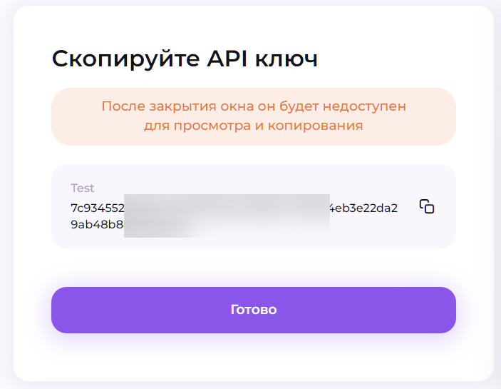
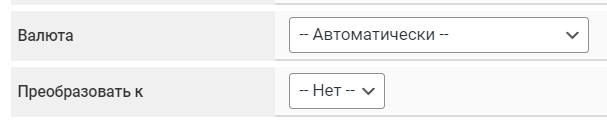

# Alfabit Crypto


Если вам необходимо обновить модуль на сервере — воспользуйтесь [инструкцией](https://premium.gitbook.io/rukovodstvo-polzovatelya/osnovnye-nastroiki/faq/kak-obnovit-faily-na-servere#moduli-merchantov)



Для обсуждения условий и подключения свяжитесь с [представителем сервиса](https://t.me/AlfaBitSupportVIP)

**Дисклеймер**: при подключении вашего сайта к тому или иному сервису, самостоятельно пожалуйста оценивайте возможные риски сотрудничества.


## Настройки в личном кабинете мерчанта

Пройдите регистрацию и верификацию в сервисе [Alfabit](https://pay.alfabit.org/). Перейдите в раздел "**Мерчанты**" и нажмите кнопку "**Создать мерчант**".

<figure><figcaption></figcaption></figure>

Заполните указанные поля и нажмите кнопку "**Создать проект**".

<figure><figcaption></figcaption></figure> <figure><figcaption></figcaption></figure> <figure><figcaption></figcaption></figure>

Перейдите в настройки мерчанта, выберите вкладку "**API ключи**" и нажмите кнопку "**Добавить**".

<figure><figcaption></figcaption></figure>

Заполните указанные поля и нажмите кнопку "**Сохранить**".

<figure><figcaption></figcaption></figure>


Выберите один или оба пункта "**Прием средств/Вывод средств**" в зависимости от цели использования мерчанта.

Добавьте IP-адрес вашего сервера для пункта "**Доверенные IP**" (желательно).


<figure><figcaption></figcaption></figure>

&#x20;Сохраните сгенерированный ключ в текстовый файл и нажмите кнопку "**Готово**".

## Настройки модуля

В панели администратора создайте нового мерчанта в разделе "**Мерчанты**" -> "**Добавить мерчант".**

Выберите Alfabit Crypto в выпадающем списке в поле "**Модуль**", укажите название для модуля и нажмите "**Сохранить**".

<figure><figcaption></figcaption></figure>

Заполните указанные авторизационные поля.

<figure><figcaption></figcaption></figure>

**API ключ** — **публичный ключ**, сгенерированный в ЛК Alfabit

## Особые поля

<figure><figcaption></figcaption></figure>

**Валюта** — выберите необходимую валюту для приема средств или пункт "**Автоматически**" (в этом случае адрес кошелька будет запрашиваться согласно коду валюты из направления обмена, где подключен мерчант (список методов будет отображаться только после указания корректного API-ключа для авторизации в модуле).

<figure><figcaption></figcaption></figure>


Обратите внимание на минимальные суммы на приём для валют, используемых вами (раздел "**Мерчанты**", вкладка "**Тарифы**" в ЛК Alfabit) — суммы по заявкам должны превышать минимальные суммы, в противном случае мерчант не обработает платеж:\
.png>)


**Преобразовать к** — выберите валюту, в которую будет конвертироваться платеж (по курсу мерчанта на момент конвертации), принятый от клиента или выберите пункт "**Нет**", чтобы отключить конвертацию. В подсказке под полем указаны возможные пары для конвертации средств (список методов будет отображаться только после указания корректного API-ключа для авторизации в модуле).

<figure><figcaption></figcaption></figure>


Обратите внимание, что заявки с суммой эквивалентом <12 USDT не будут конвертироваться (ограничения на стороне мерчанта) при включенной опции — средства по таким заявкам будут приходить на счёт в изначальной валюте

.png>)


## Продолжение настройки

Далее произведите настройку мерчанта следуя [общей инструкции по настройке](https://premium.gitbook.io/rukovodstvo-polzovatelya/osnovnye-nastroiki/merchanty-i-avtovyplaty/merchanty/obshie-nastroiki-merchantov).\
