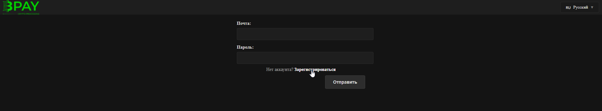
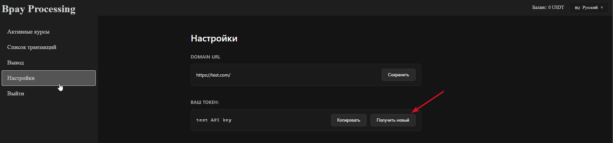
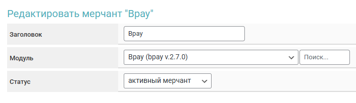

# Bplay


Если вам необходимо обновить модуль на сервере — воспользуйтесь [инструкцией](https://premium.gitbook.io/main/osnovnye-nastroiki/faq/obnovlenie-failov-skripta-na-servere/kak-obnovit-faily-na-servere#moduli-merchantov-i-avtovyplat)



Для обсуждения условий и подключения, свяжитесь с [представителем сервиса.](https://t.me/bpay_processing)

**Дисклеймер**: при подключении вашего сайта к тому или иному сервису, самостоятельно пожалуйста оценивайте возможные риски сотрудничества.


## Настройки в личном кабинете мерчанта

После получения реквизитов для входа от [представителя сервиса](https://t.me/bpay_processing), авторизуйтесь в личном кабинете на [сайте Bpay](https://bpay-processing.com/).

<figure><figcaption></figcaption></figure>

Перейдите в раздел "Настройки" и сформируйте токен в блоке "Ваш токен".

<figure><figcaption></figcaption></figure>

Сохраните полученные данные в текстовый файл.

## Настройки модуля

В панели администратора создайте нового мерчанта в разделе "**Мерчанты**" -> "**Добавить мерчант**".

Выберите Bpay в выпадающем списке в поле "**Модуль**", укажите название для модуля и нажмите "**Сохранить**".

<figure><figcaption></figcaption></figure>

Заполните указанные авторизационные поля.

<figure><figcaption></figcaption></figure>

**Домен** — не заполняйте поле, оставьте его пустым.

**API ключ** — **Ваш токен**, сгенерированный в личном кабинете мерчанта.

## Особые поля

<figure><figcaption></figcaption></figure>

**Код валюты** — Выберите валюту для приёма в модуле или поле для обозначения такой валюты в системе.

**Cron-файл -** [создайте задание](../../faq/kak-sozdat-zadanie-cron-na-servere.md) с такой ссылкой на сервер&#x435;**.**

## Продолжение настройки

Дополнительные настройки модуля выполняются согласно [общей инструкции по настройке](https://premium.gitbook.io/rukovodstvo-polzovatelya/osnovnye-nastroiki/merchanty-i-avtovyplaty/merchanty/obshie-nastroiki-merchantov).
