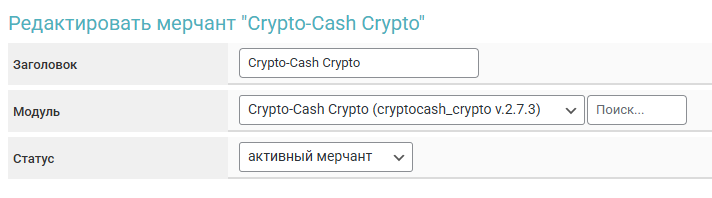

# Crypto-Cash Crypto


Если вам необходимо обновить модуль на сервере — воспользуйтесь [инструкцией](https://premium.gitbook.io/main/osnovnye-nastroiki/faq/obnovlenie-failov-skripta-na-servere/kak-obnovit-faily-na-servere#moduli-merchantov-i-avtovyplat)


## Настройки в личном кабинете мерчанта


Для обсуждения условий работы свяжитесь с [представителем сервиса](https://t.me/CEO_CryptoCash).

**Дисклеймер**: при подключении вашего сайта к тому или иному сервису, пожалуйста, самостоятельно оценивайте возможные риски сотрудничества.


[Зарегистрируйтесь на сервисе Crypto-Cash](https://account.crypto-cash.world/registration) и авторизуйтесь в личном кабинете.

Перейдите в [раздел с настройками мерчанта](https://account.crypto-cash.world/overview). Выпустите API-ключи по кнопке "**Сгенерировать API ключ**".

<figure><figcaption></figcaption></figure>


При генерации API ключей выбирайте метод **ED25519**.&#x20;

Legacy ключи сейчас также будут работать, но перестанут поддерживаться в будущем.



Скопируйте секретный и публичный ключи в буфер обмена или текстовый файл.

<figure><figcaption></figcaption></figure>

Установите ограничения доступа (при использовании мерчанта на прием отметьте "**Пополнение**" и "**История транзакций**").&#x20;

Укажите в поле "**URL вебхука**" ссылку "**Webhook"** из настроек модуля на прием средств.

## Настройки модуля

В панели администратора создайте нового мерчанта в разделе "**Мерчанты**" ➔ "**Добавить мерчант".**

Выберите подходящий модуль в выпадающем списке в поле "**Модуль**", укажите название для модуля и нажмите "**Сохранить**".

<figure><figcaption></figcaption></figure>

Заполните указанные авторизационные поля.

<figure><figcaption></figcaption></figure>

**Домен** — оставьте поле пустым

**Публичный ключ** — публичный ключ, скопированный ранее в ЛК Crypto-Cash

**Секретный ключ** — секретный ключ, скопированный ранее в ЛК Crypto-Cash

## Особые поля

<figure><figcaption></figcaption></figure>

**API key type** — выберите тип ключей согласно ранее выбранному в ЛК Crypto-Cash при создании ключей

<figure><figcaption></figcaption></figure>

**Валюта** — выбор валюты для выдачи адреса кошелька (при выборе пункта "**Автоматически**" будет использоваться код валюты "**Отдаю**")

* **добавить** — добавление своего кода валюты

## Продолжение настройки

**Cron-файл -** [создайте задание](https://premium.gitbook.io/main/osnovnye-nastroiki/faq/kak-sozdat-zadanie-cron-na-servere) с такой ссылкой на сервер&#x435;**.**

Дополнительные настройки модуля выполняются согласно [общей инструкции по настройке](https://premium.gitbook.io/rukovodstvo-polzovatelya/osnovnye-nastroiki/merchanty-i-avtovyplaty/merchanty/obshie-nastroiki-merchantov).
