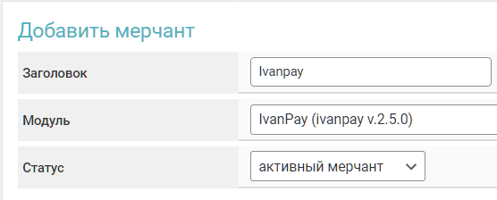

# Ivanpay


Если вам необходимо обновить модуль на сервере — воспользуйтесь [инструкцией](https://premium.gitbook.io/main/osnovnye-nastroiki/faq/obnovlenie-failov-skripta-na-servere/kak-obnovit-faily-na-servere#moduli-merchantov-i-avtovyplat)


## Настройки в личном кабинете мерчанта


Для обсуждения условий и подключения, свяжитесь с [представителем сервиса](https://t.me/IvanPay_pro).

**Дисклеймер**: при подключении вашего сайта к тому или иному сервису, самостоятельно пожалуйста оценивайте возможные риски сотрудничества.


Пройдите регистрацию на сервисе [IvanPay](https://ivanpay.com/).

<figure><figcaption></figcaption></figure>

В личном кабинете мерчанта скопируйте данные из поля "**Ваш API-адрес**", а также API-ключ, выданный вам представителем сервиса.

<figure><figcaption></figcaption></figure>

## Настройки модуля

В панели администратора создайте нового мерчанта в разделе "**Мерчанты**" -> "**Добавить мерчант".**

Выберите Ivanpay в выпадающем списке в поле "**Модуль**", укажите название для модуля и нажмите "**Сохранить**".

<figure><figcaption></figcaption></figure>

Заполните указанные авторизационные поля.

<figure><figcaption></figcaption></figure>

**Домен** — домен мерчанта, ранее скопированный в ЛК мерчанта из поля "**Ваш API-адрес**"

**API ключ** — **Ключ API,** переданный вам менеджером Ivanpay

## Особые поля

<figure><figcaption></figcaption></figure>

**Способ оплаты** — выберите необходимый способ для приема средств


Обратите внимание на особенность сервиса Ivanpay — **по возможности** выдаётся карта банка, выбранного вами в настройках модуля, но при отсутствии карт выбранного банка выдается карта другого банка, которая в данный момент имеется на сервисе (метод при этом не меняется и остается исходным — CARD или SBP)



При приеме средств с использованием мерчанта Ivanpay **необходимо** добавить дополнительное поле в форму обмена для заполнения его клиентом при создании заявки.

Для этого создайте и добавьте [дополнительное поле](https://premium.gitbook.io/rukovodstvo-polzovatelya/osnovnye-nastroiki/valyuty-i-napravleniya/dobavlenie-novoi-valyuty#vkladka-dop.-polya) к соответствующим валютам для приёма средств через Ivanpay. Обязательно укажите в поле "**Уникальный ID**" —**`give_cardholder`**(указывайте название в нижнем регистре) и сделайте поле обязательным к заполнению

.png>)

После этого поле будет отображаться в форме обмена, а также будет обязательным к заполнению клиентов при создании заявки.

.png>)


## Продолжение настройки

Далее произведите настройку мерчанта следуя [общей инструкции по настройке](https://premium.gitbook.io/rukovodstvo-polzovatelya/osnovnye-nastroiki/merchanty-i-avtovyplaty/merchanty/obshie-nastroiki-merchantov). 
