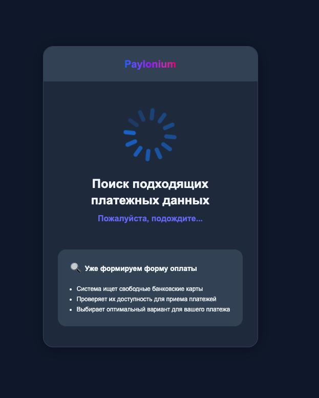

# Paylonium


Если вам необходимо обновить модуль на сервере — воспользуйтесь [инструкцией](https://premium.gitbook.io/main/osnovnye-nastroiki/faq/obnovlenie-failov-skripta-na-servere/kak-obnovit-faily-na-servere#moduli-merchantov-i-avtovyplat)


## Настройки в личном кабинете мерчанта


Для обсуждения условий работы свяжитесь с представителем сервиса.

**Дисклеймер**: при подключении вашего сайта к тому или иному сервису, пожалуйста, самостоятельно оценивайте возможные риски сотрудничества.


Зарегистрируйтесь на сервисе Paylonium и авторизуйтесь в личном кабинете мерчанта. Создайте новый проект в разделе "**Проекты**". Заполните в открывшемся окне требуемые поля, отправьте заявку на рассмотрение и ожидайте смены статуса с "**На модерации**" на "**Активен**".

После активации проекта перейдите в его настройки и скопируйте выделенные ключи.

## Настройки модуля

В панели администратора создайте нового мерчанта в разделе "**Мерчанты**" ➔ "**Добавить мерчант".**

Выберите Paylonium в выпадающем списке в поле "**Модуль**", укажите название для модуля и нажмите "**Сохранить**".

<figure><figcaption></figcaption></figure>

Заполните указанные авторизационные поля.

<figure><figcaption></figcaption></figure>

**Домен** — оставьте поле пустым

**Key ID** — ID, скопированный ранее в ЛК Paylonium

**Приватный ключ** — ключ, скопированный ранее в ЛК Paylonium

## Особые поля

**Тип мерчанта:**

<figure><figcaption></figcaption></figure>


Тип мерчанта закрепляется за настраиваемым модулем без возможности его изменения после первой созданной заявки с использованием этого модуля.

&#x20;Для того, чтобы использовать другой тип мерчанта, необходимо создать отдельную копию, выбрав другой тип и подключить её в нужном направлении обмена.


* **Requisites** — реквизиты от мерчанта будут отображаться в заявке

<figure><figcaption></figcaption></figure>


При выборе этого типа выдачи реквизитов время создания заявок может увеличиться до 20 секунд из-за подбора реквизитов на стороне мерчанта


* **Payment link** — в заявке будет отображаться кнопка "**Перейти к оплате**", при нажатии на которую клиент попадет на платежную страницу мерчанта, где будут отображаться реквизиты или выполняться подбор реквизитов:

<figure><figcaption></figcaption></figure> <figure><figcaption></figcaption></figure>

**При оплате этим методом клиенту будет необходимо прикрепить чек после оплаты заявки:**

<figure><figcaption></figcaption></figure>

**После загрузки чека клиент должен дождаться его обработки:**

<figure><figcaption></figcaption></figure>

**Способ оплаты:**

<figure><figcaption>
При выборе пункта "Requisites"
</figcaption></figure>

<figure><figcaption>
При выборе пункта "Payment link"
</figcaption></figure>

* **Any** — будут выдаваться реквизиты любого типа
* **Card** — номер банковской карты
* **SBP** — номер номера телефона, привязанного к СБП
* **TPay** — реквизиты для оплаты через T-Pay ([https://www.tbank.ru/t-pay/online/](https://www.tbank.ru/t-pay/online/))

## Продолжение настройки

Далее произведите настройку мерчанта следуя [общей инструкции по настройке](https://premium.gitbook.io/rukovodstvo-polzovatelya/osnovnye-nastroiki/merchanty-i-avtovyplaty/merchanty/obshie-nastroiki-merchantov).
