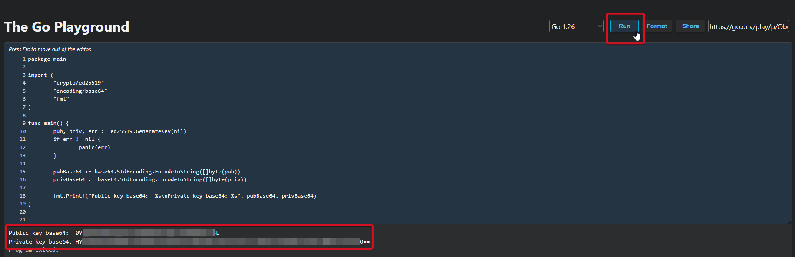

# Unite


Если вам необходимо обновить модуль на сервере — воспользуйтесь [инструкцией](https://premium.gitbook.io/main/osnovnye-nastroiki/faq/obnovlenie-failov-skripta-na-servere/kak-obnovit-faily-na-servere#moduli-merchantov-i-avtovyplat)


## Настройки в личном кабинете мерчанта


Для обсуждения условий работы свяжитесь с [представителем сервиса](https://t.me/Unite_Plat).

**Дисклеймер**: при подключении вашего сайта к тому или иному сервису, пожалуйста, самостоятельно оценивайте возможные риски сотрудничества.


Для начала работы с мерчантом вам потребуется сгенерировать уникальные ключи:

1.  [**Перейдите по ссылке**](https://go.dev/play/p/ObeQCMpMBWe)**.** Должен открыться сайт с уже добавленным кодом.&#x20;

    Запустите код нажав кнопу "**Run**".

<figure><figcaption></figcaption></figure>

2. В выдаче вы получите [публичный ](#user-content-fn-1)[^1]и [приватный ](#user-content-fn-2)[^2]ключи. Такие ключи будут уникальными при каждой генерации.
3. Скопируйте полученные ключи и сохраните их в отдельном текстовом файле.
4. Свяжитесь с [представителем сервиса](https://t.me/Unite_Plat) для регистрации личного кабинета.
5. Укажите в сообщении ваш сгенерированный выше <mark style="color:red;">**публичный**</mark> <mark style="color:red;"></mark><mark style="color:red;">ключ</mark> и электронную почту для привязки аккаунта в системе. Не передавайте приватный ключ.
6. Получите от представителя сервиса Key ID и сохрание в файле с ключами созданном ранее, он потребуется для работы  модуля

## Настройки модуля

В панели администратора создайте нового мерчанта в разделе "**Мерчанты**" ➔ "**Добавить мерчант".**

Выберите Unite в выпадающем списке в поле "**Модуль**", укажите название для модуля и нажмите "**Сохранить**".

<figure><figcaption></figcaption></figure>

Заполните указанные авторизационные поля.

<figure><figcaption></figcaption></figure>

**Домен** — не заполняйте поле, оставьте его пустым.

**Key ID** — Key ID, полученный вами ранее от представителя Unite.

**Приватный ключ** — [приватный ключ](#user-content-fn-3)[^3] сгенерированный вами на первом шаге настройки.

## Особые поля

**Тип мерчанта:**

<figure><figcaption></figcaption></figure>


Тип мерчанта закрепляется за настраиваемым модулем без возможности его изменения после первой созданной заявки с использованием этого модуля.

Для того, чтобы использовать другой тип мерчанта, необходимо создать отдельную копию, выбрав другой тип и подключить её в нужном направлении обмена.


* **Requisites** — реквизиты от мерчанта будут отображаться в самой заявке

<figure><figcaption></figcaption></figure>


При выборе этого типа выдачи реквизитов время создания заявок может увеличиться до 20 секунд из-за подбора реквизитов на стороне мерчанта


* **Payment link** — в заявке будет отображаться кнопка "**Перейти к оплате**", при нажатии на которую клиент попадет на платежную страницу мерчанта, где будут отображаться реквизиты или выполняться подбор реквизитов с последующим их отображением:

<div><figure><figcaption></figcaption></figure> <figure><figcaption></figcaption></figure></div>

При оплате методом **Payment link** клиенту будет необходимо прикрепить чек после оплаты заявки:

<figure><figcaption></figcaption></figure>

После загрузки чека клиент должен дождаться его обработки:

<figure><figcaption></figcaption></figure>

**Способ оплаты:**



<figure><figcaption><p>При выборе пункта "Requisites"</p></figcaption></figure>

* **Card** — номер банковской карты
* **SBP** — номер номера телефона, привязанного к СБП



<figure><figcaption></figcaption></figure>


* **Any** — будут выдаваться реквизиты любого формата, указанного ниже
* **Card** — номер банковской карты
* **SBP** — номер номера телефона, привязанного к СБП
* **TPay** — реквизиты для оплаты через [сервис T-Pay](https://www.tbank.ru/t-pay/online/)



## Продолжение настройки

Далее произведите настройку мерчанта следуя [общей инструкции по настройке](https://premium.gitbook.io/rukovodstvo-polzovatelya/osnovnye-nastroiki/merchanty-i-avtovyplaty/merchanty/obshie-nastroiki-merchantov).

[^1]: 

    ```
    Public key
    ```

[^2]: 

    ```
    Private key
    ```

[^3]: 
