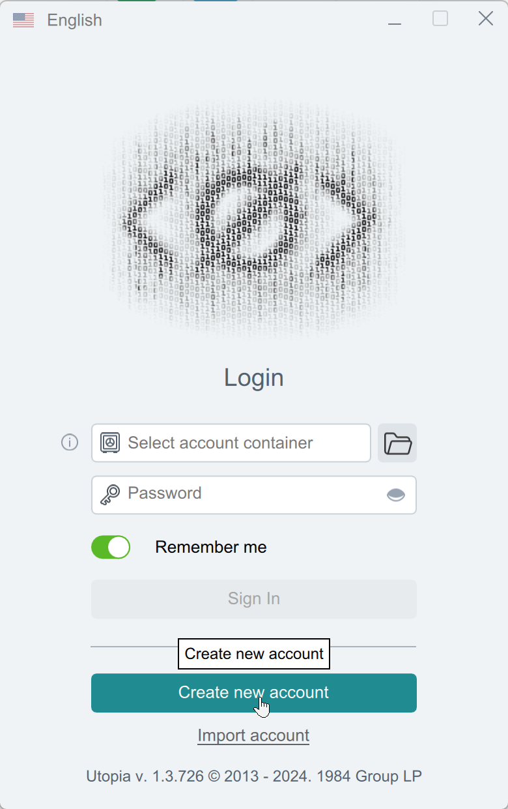

# Utopia


Если вам необходимо обновить модуль на сервере — воспользуйтесь [инструкцией](https://premium.gitbook.io/main/osnovnye-nastroiki/faq/obnovlenie-failov-skripta-na-servere/kak-obnovit-faily-na-servere#moduli-merchantov-i-avtovyplat)


## Настройки на стороне мерчанта


Первоначальную настройку сервиса на вашем сервере вам поможет произвести техподдержка мерчанта:

* Utopia Messenger: UNKNOWN1\
  .png>)
* Telegram: [@utp1984](https://t.me/utp1984)
* Email: [1984@u.is](mailto:1984@u.is)


Скачайте [приложение Utopia](https://u.is/en/download.html) под вашу операционную систему и установите его. Пройдите процесс регистрации и создайте новый кошелек.

<figure><figcaption>
Создание аккаунта
</figcaption></figure>

<figure><figcaption>
Заполните указанные поля
</figcaption></figure>

<figure><figcaption>
Укажите путь до папки, где будет храниться приватный ключ и придумайте пароль для кошелька 
</figcaption></figure>

<figure><figcaption>
Генерация приватного ключа
</figcaption></figure>

<figure><figcaption>
Публичный ключ — это адрес вашего кошелька
</figcaption></figure>

<figure><figcaption>
Главная страница приложения
</figcaption></figure>

<figure><figcaption>
Доступные валюты
</figcaption></figure>

## Настройки модуля

В панели администратора создайте нового мерчанта в разделе "**Мерчанты**" -> "**Добавить мерчант".**

Выберите Utopia в выпадающем списке в поле "**Модуль**", укажите название для модуля и нажмите "**Сохранить**".

<figure><figcaption></figcaption></figure>

Заполните указанные авторизационные поля.

<figure><figcaption></figcaption></figure>

**Домен** — URL для подключения (IP-адрес вашего сервера + порт, присвоенный приложению при первоначальной настройке)

**Токен** — публичный ключ (адрес вашего кошелька, полученный при регистрации в сервисе)


Для корректной выдачи реквизитов код валюты из "Отдаю" должен быть выбран как USD, UUSD или CRP (токен Crypton)

.png>)


## Модуль Utopia Voucher

Для приема в качестве платежа ваучеров Utopia настройте отдельный модуль.

### Настройки модуля

В панели администратора создайте нового мерчанта в разделе "**Мерчанты**" -> "**Добавить мерчант".**

Выберите Utopia Voucher в выпадающем списке в поле "**Модуль**", укажите название для модуля и нажмите "**Сохранить**".

<figure><figcaption></figcaption></figure>

Заполните указанные авторизационные поля.

<figure><figcaption></figcaption></figure>

**Домен** — URL для подключения (IP-адрес вашего сервера + порт, присвоенный приложению при первоначальной настройке)

**Токен** — публичный ключ (адрес вашего кошелька, полученный при регистрации в сервисе)


Для корректного приема ваучеров код валюты из "**Отдаю**" должен быть равен UUSD (американский доллар) или CRP (нативный токен Utopia)

В форме обмена не требуется добавлять поле "**Со счета**" для валюты "**Отдаю**" — в созданной заявке клиенту будет отображаться кнопка "**Перейти к оплате**", по нажатию которой откроется страница с полем для ввода кода ваучера. После воода корректного кода клиент будет перенаправлен обратно на страницу заявки.


## Продолжение настройки

Далее произведите настройку мерчанта следуя [общей инструкции по настройке](https://premium.gitbook.io/rukovodstvo-polzovatelya/osnovnye-nastroiki/merchanty-i-avtovyplaty/merchanty/obshie-nastroiki-merchantov).\
