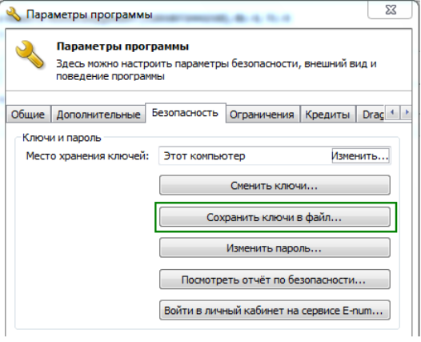

# Интерфейс Х19 (Webmoney)

Модуль "**Webmoney X19**" вы можете активировать в панели управления в разделе "**Модули" → "Модули"**.

Модуль X19 позволяет осуществлять следующие автоматические проверки перед созданием заявки на обмен:

1. WM ↔ WM. Проверка принадлежности кошельков к одному WMID.
2. Наличные в офисе ↔ WM. Проверка ФИО и номера паспорта\* клиента.
3. Банковский счет ↔ WM. Проверка ФИО клиента.
4. Банковская карта ↔ WM. Проверка ФИО клиента.
5. Системы денежных переводов ↔ WM. Проверка ФИО клиента.
6. SMS ↔ WM. Проверка номера телефона клиента.
7. PayPal ↔ WM. Проверка номера счета клиента.
8. Skrill (Moneybookers) ↔ WM. Проверка номера счета клиента.
9. QIWI Кошелёк ↔ WM. Проверка номера счета клиента.
10. Яндекс.Деньги ↔ WM. Проверка номера счета клиента.
11. EasyPay ↔ WM. Проверка номера счета клиента.

\* — проверка номера паспорта происходит только в направление WM → Наличные в офисе.

Все проверки в модуле X19 работают в обе стороны: WM → XXX и XXX → WM.

Если какая-то из платежных систем не представлена в списке проверок, то это значит, что обмен с участием этой платежной системы запрещен правилами WebMoney.

Чтобы настроить модуль Х19, выполните следующие шаги:

1. Ваш обменник должен находиться в каталоге [Мегасток](https://megastock.ru/) хотя бы в одном из разделов: «Онлайн-обмен электронных валют», «Ввод-вывод электронных валют», «Мобильная связь». Если сайт будет отсутствовать в каталоге Мегасток, то у вас не будет доступа к XML интерфейсу X19.


Администрация каталога Мегасток строго следит за тем, чтобы соблюдались [правила размещения в каталоге](https://megastock.ru/site_requirements.aspx). Рекомендуем предварительно ознакомиться с ними, выполнить все необходимые пункты правил и только после этого отправлять запрос на размещение каталоге.


2. В своем WebMoney Keeper Classic в пункте меню "**Инструменты "→ "Параметры программы"**. Далее перейдите на вкладку **"Безопасность"** и нажмите кнопку **"Сохранить ключ в файл"**. Пройдите процедуры, которые предлагает выполнить WM Keeper. Укажите путь для сохранения файла ключей, дважды введите ваш пароль от файла ключей.

<figure><figcaption></figcaption></figure>

3. Сохраненный файл ключей .kwm необходимо загрузить на хостинг в директорию: `ваш_домен/wp-content/plugins/premiumbox/moduls/x19/webmoney`.
4. На хостинге откройте файл `ваш_домен/wp-content/plugins/premiumbox/moduls/x19/webmoney/index.php` для редактирования (кодировка файла UTF-8) и пропишите в нём следующие настройки:


Если в указанной директории нет файла `index.php`, то переименуйте файл `primer.php` в `index.php` и произведите настройки.


* `define('WMX19_ID', '123456789000'); // Укажите ваш WMID.`
* `define('WMX19_KEEPER_TYPE','CLASSIC'); // Оставьте CLASSIC без изменений, если у вас WM Keeper WinPro (Classic), или впишите LIGHT, если у вас WM Keeper Light WebPro (Light)`
* `define('WMX19_CLASSIC_KEYPATH',PN_PLUGIN_DIR.'moduls/x19/webmoney/123456789000.kwm'); // Укажите имя вашего файла ключей .kwm.`
* `define('WMX19_CLASSIC_KEYPASS','123456'); // Укажите пароль от файла ключей .kwm, который вы использовали при сохранения ключа в WM Keeper.`
* `define('WMX19_LIGHT_CERTPATH',PN_PLUGIN_DIR.'moduls/x19/webmoney/123456789000.cer'); // Абсолютный путь к сертификату .cer. ТОЛЬКО для WM Keeper WebPro (Light)`
* `define('WMX19_LIGHT_KEYPATH','PN_PLUGIN_DIR.'moduls/x19/webmoney/123456789000.key'); // Абсолютный путь к приватному ключу .key. только для WM Keeper WebPro (Light)`
* `define('WMX19_LIGHT_KEYPASS','123456'); // Пароль от приватного ключа .key. только для WM Keeper WebPro (Light)`

5. Для определения WMID используется XML интерфейс Х8, который автоматически активируется при подключении XML интерфейса X2. Активируйте XML интерфейс X2 в [настройках мерчанта](https://merchant.webmoney.ru/conf/purses.asp) в блоке "Дополнительные параметры".
6. При создании направлений обмена в обменнике у вас появится возможность выбирать тип проверки по интерфейсу X19.
