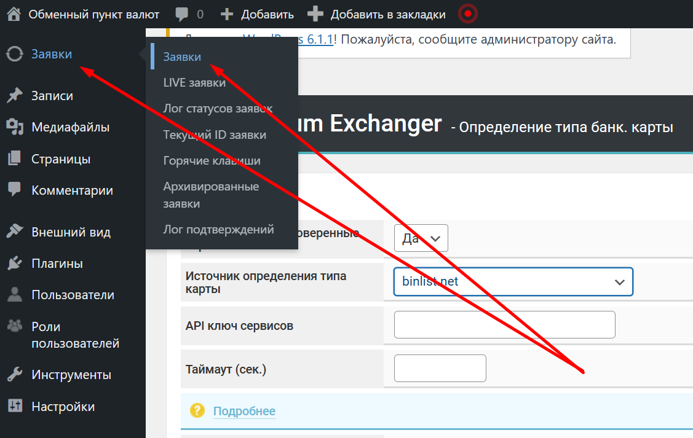

# Определение типа карты



1. Чтобы подключить определение типа банковской карты, необходимо перейти в раздел "**Модули" -> "Модули"**, убедиться, что активен модуль "**Информация о банковской карте**". Если неактивен - активируйте.

<figure><figcaption></figcaption></figure>

2. Перейдите в раздел "**Модули" -> "Определение банковских карт"** и выполните следующие настройки:

<figure><figcaption></figcaption></figure>

* **Запоминание уже проверенной карты:**\
  • **Да** - не делать повторное определение карты, если один раз уже определили её тип
* **Источник определения типа карты**:\
  • **По первым цифрам номера карт** - способ проверки, когда внутри системы уже есть информация о соответствующих цифрах той или иной платежной системы: Visa, Mastercard, AmericanExpress и т. д.)\
  • **Bincodes.com и Binlist.net -** сервисы, через которые автоматизируется этот процесс - они определяют не только тип платежной системы, но ещё и банк, которому принадлежит карта. Эти сервисы платные и требуют ввода API-ключа в поле ниже "**API ключ сервисов**_"_, который можно получить на сайте выбранного сервиса
* **Таймаут** - при использовании автоматического сервиса, необходимо указать в строке время, которое система будет ждать ответа от API. Рекомендуемое время 15-30 секунд. Если ответа в определенный период не будет, проверка будет пропущена
* **Валюты** - валюты, для которых будет осуществляться проверка

3. Перейдите в раздел "**Заявки" -> "Заявки"**.&#x20;

<figure><figcaption></figcaption></figure>

Когда будет создана заявка с участием карты, в блоке с информацией о заявке будет выводиться информация о карте. В случае внутренней проверки, будет выводится тип карты (Visa, Mastercard и т. п.), а если с помощью автоматического сервиса - еще и наименование банка.
