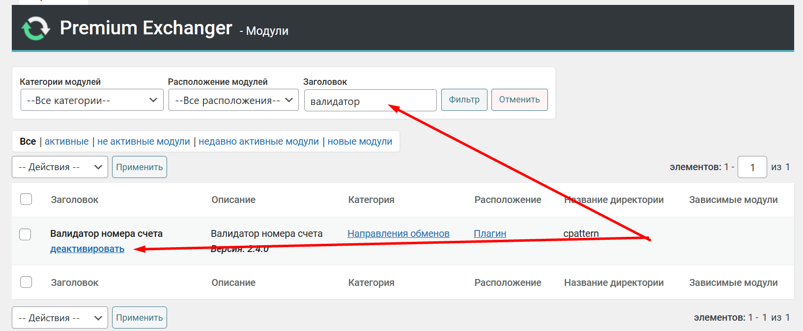

# Валидатор криптокошелька



1. Чтобы подключить валидатор криптокошелька, который вводит пользователь в форме создания заявки, необходимо зайти в раздел "**Модули" -> "Модули"** и убедиться, что активен модуль "**Валидатор номера счета"**.&#x20;

<figure><figcaption></figcaption></figure>

2. Зайдите в раздел "**Валюты" -> "Валюты",** выберите в поиске необходимую платежную систему и перейдите к редактированию. Перейдите на вкладку "**Настройка полей"**. Найдите поле "**Валидатор номер счета"**. Выберите в поле нужную валюту и сохраните настройки.

<figure><figcaption></figcaption></figure>

<figure><figcaption></figcaption></figure>

Соответственно, при создании заявки, система будет проверять валидность введённого адреса пользователем. В случае ввода пользователем некорректного адреса кошелька — будет выдавать пользователю ошибку.&#x20;
