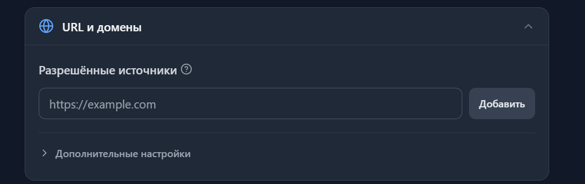

# Онлайн-чат Chatonio

[Chatonio](https://chatonio.com/) - сервис поддержки клиентов с веб-чатом и возможностью использования ИИ для обработки обращений. В Premium Exchanger доступен отдельный модуль для подключения виджета Chatonio к сайту.

После подключения виджет отображается на страницах обменника. Основные параметры самого чата - внешний вид, приветствие, положение кнопки, база знаний, работа операторов и другие настройки  задаются в личном кабинете Chatonio. Premium Exchanger отвечает непосредственно за подключение виджета к сайту

### 1. Создание проекта и веб-чата в Chatonio

1. Перейдите на сайт[ chatonio.com](https://chatonio.com/) и зарегистрируйтесь, либо войдите в существующий аккаунт.
2. В панели Chatonio создайте проект для вашего обменника.
3. В проекте создайте канал типа Web Chat.
4. В настройках канала,укажите домен обменника в разделе “URL и домены”

Домен необходимо указывать вместе со схемой сайта, например https://site.com.

После сохранения настроек получение доступа с нового домена может занять некоторое время.

 

### 2. Активация модуля Chatonio в Premium Exchanger

Активируйте модуль в разделе:

Модули → Модули 

\
Если вы не видите модуль Chatonio в списке доступных, [потребуется обновить Premium Exchanger до последней версии](https://premium.gitbook.io/main/osnovnye-nastroiki/faq/obnovlenie-failov-skripta-na-servere/kak-obnovit-faily-na-servere#faily-skripta). 

### 3. Получение Chatonio Channel ID

Откройте настройки созданного веб-чата в личном кабинете Chatonio, в разделе "Виджет веб-чата" выберите вкладку "Только ID" и полностью скопируйте содержимое поля “ID канала”. 

<figure><figcaption></figcaption></figure>

### 4. Подключение Chatonio в Premium Exchanger

После активации модуля перейдите в панели управления обменником:

Настройки → Основные настройки

Найдите поле Chatonio Channel ID и вставьте в него скопированный ранее ID канала.&#x20;

Сохраните изменения.


Поле Chatonio Channel ID является мультиязычным, однако при использовании одного канала для всего сайта достаточно указать идентификатор в одном из языков. Он будет использоваться на всех языковых версиях сайта. \
\
Указывать отдельные Channel ID для разных языков имеет смысл, если обращения должны поступать в разные каналы Chatonio, например разным операторам.&#x20;

Если поле Chatonio Channel ID оставить пустым, виджет Chatonio на сайте выводиться не будет


После сохранения настроек откройте сайт обменника и убедитесь, что кнопка чата появилась и диалог открывается корректно.

### 5. Настройка внешнего вида и поведения виджета

Внешний вид и поведение веб-чата настраиваются непосредственно в личном кабинете Chatonio. В частности, там можно настроить:

* оформление и цветовую схему
* положение кнопки чата
* приветствие
* работу операторов и ИИ
* базу знаний
* видимость виджета на отдельных URL


Если на сайте уже используется другой чат, например Jivo, рекомендуем отключить его после подключения Chatonio. В противном случае на сайте одновременно будут отображаться кнопки обоих сервисов.


### Дополнительные настройки

#### Светлая и тёмная тема

Если на сайте используется переключение между светлой и тёмной темой, настройте соответствующую цветовую схему виджета в Chatonio.

 

#### Расположение кнопки

По умолчанию кнопка чата может располагаться в нижнем правом углу страницы. Если в этой области уже находятся другие элементы сайта, измените положение кнопки или задайте необходимые отступы в настройках Chatonio.

#### Скрытие чата на отдельных страницах

Для управления отображением виджета на отдельных страницах используйте настройки видимости по URL в настройках канала, раздел “URL и домены”.

Настраивать отдельное исключение в панели Premium Exchanger для этого не требуется.

\
\
\
 
