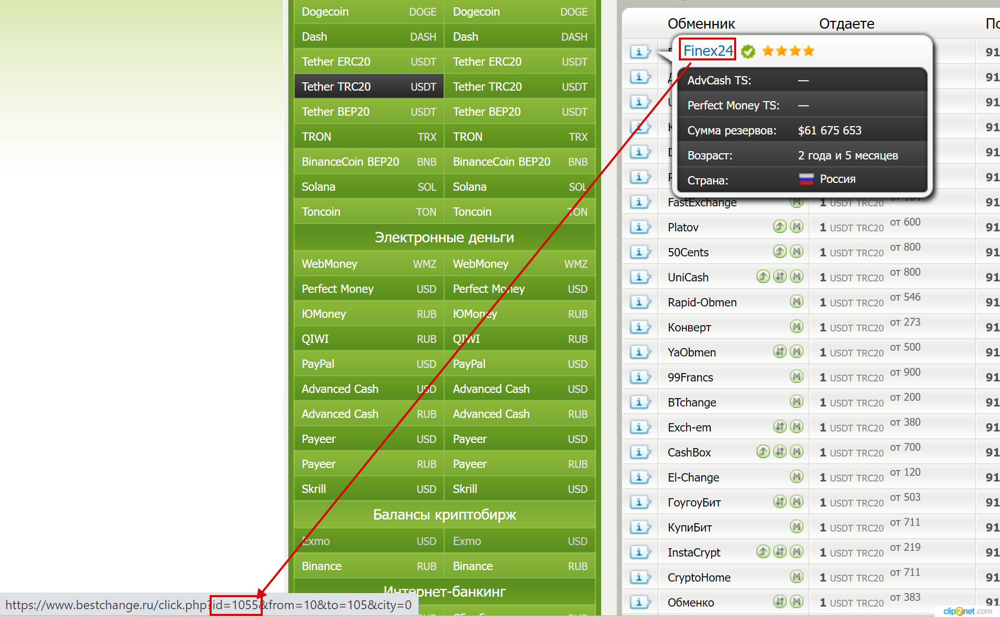

# Bestchange парсер (old)


Внимание: модуль устарел и заменен на [Bestchange API парсер](https://premium.gitbook.io/main/osnovnye-nastroiki/valyuty-i-napravleniya-obmena/kursy-valyut/bestchange-api-parser-new-nachinaya-s-v2.6).

Пожалуйста, используйте новый модуль — старый модуль может перестать работать в любой момент, так как Bestchange в скором времени прекратит поддержку формата парсинга курсов, совместимого с модулем.



Для автоматического обновления курсов валют **обязательно** создайте [задание Cron](https://premium.gitbook.io/rukovodstvo-polzovatelya/osnovnye-nastroiki/faq/kak-sozdat-zadanie-cron-na-servere) на сервере, используя ссылку из раздела "**BestChange парсер**" — "**Настройки**"

.png>)

Хэш для ссылки для задания cron задается в файле **`wp-content/plugins/premiumbox/userdata.php`**\
.png>)

Ссылка с хэшем в настройках модуля\
.png>)



Для корректной работы модуля требуется расширение PHP: zip.



Обратите внимание, что использование Bestchange парсера не гарантирует вам место в списке обменников на Bestchange, которое вы указываете в настройках парсера.

Модуль доступен для всех обменников, использующих скрипт Premium Exchanger — ваш конкурент может настроить парсер также как и вы, поэтому все обменники, которые используют парсер, будут находиться в борьбе за указанное место (чаще всего это 1-я позиция) в выбранном направлении обмена.

Единственный вариант гарантированного нахождения на первом месте — **постоянный демпинг**.

Также вы можете дополнительно настроить мин. и макс. курсы по этой инструкции, чтобы случайно не уйти в минус, если другой обменник решил демпинговать (это потянет вас за ним, если выбрана привязка к первому месту и не настроена опция мин./макс. курсы).



Bestchange парсер будет работать только в активном направлении обмена — при настройках парсера обязательно сделайте направление активным перед началом настройки!





1. В разделе "**Модули" → "Модули"** активируйте модуль "**Bestchange парсер**". Для активации наведите на название мерчанта и кликните по ссылке "**Активировать**".
2. В разделе "**BestChange парсер" → "Настройки"** в поле "**Черный список ID обменников (через запятую)**" укажите ID вашего обменника, который выдал вам сервис Bestchange. Если вашего обменника нет в сервисе Bestchange, то поле "**Черный список ID обменников (через запятую)**" оставьте пустым и сохраните изменения. Затем в этом же разделе перейдите по ссылке "**Cron URL для обновления курсов в модуле BestChange парсер**".

<figure><figcaption></figcaption></figure>

Как узнать ID обменника?

Кликните на изображение ниже, чтобы увидеть, как найти ID обменника на сайте Bestchange.

При необходимости в поле "**Белый лист ID обменников (через запятую)**" укажите ID обменных пунктов на сайте Bestchange, которые необходимо учитывать при парсинге курсов. Остальные обменные пункты будут игнорироваться. Если поле оставить пустым, то курсы всех обменных пунктов будут учитываться при парсинге.

3. В панели управления в разделе "**BestChange парсер" → "Настройки"** обновите страницу и вы увидите список доступных валют. Отметьте галочками те валюты, которые вы планируете использовать. Сохраните изменения.

<figure><figcaption></figcaption></figure>

4. В панели управления в разделе "**Направления обменов" → "Направления обменов"** перейдите к редактированию направления обмена.
5. На вкладке "**Автокорректировка курса**" перед началом настройки парсера BestChange отключите любые действующие автокорректировки курса, если такие настройки используются.

<figure><figcaption></figcaption></figure>

На вкладке "**BestChange парсер**" вы увидите блок настроек. Выполните необходимые настройки:

<figure><figcaption></figcaption></figure>

* с помощью параметра "**Включить парсер**" разрешите работу парсера (парсер будет работать, только если выбраны валюты в следующем пункте)
* с помощью выпадающего меню "**Валюты (Отдаете)**" и "**Валюты(Получаете)**" выберите направление обмена, которое хотите использовать как источник для парсинга
* в поле "**Позиция**" укажите номер позиции в мониторинге, к которой вы хотите привязать свой курс


Можно также указать, к примеру, **1-6** — это будет означать среднее значение среди первых 6 позиций


* в поле "**Мин. резерв для позиции**" можно указать значение минимального резерва для позиции (валюта "**Получаете**"). Обменники, с резервом менее указанного значения, будут игнорироваться модулем
* в поле "**Шаг**" укажите значение (например 0.0001), на которое будет изменяться курс. Система по умолчанию всегда делает ваш курс выгоднее курса заданной позиции. Также шаг можно задать в виде процента (например 3%). Значение шага со знаком минус будет делать ваш курс хуже курса заданной позиции  (-0.00001 или -3%), также можно использовать умножение и деление (\*2 или /2, \*3% или /3%)
* в полях "**Мин. курс**" и "**Макс. курс**" вы можете задать предельные значения курса в рамках которого будет работать привязка к позиции. Если конкурент по заданной позиции выйдет за рамки минимального или максимального курса, то модуль сбросит ваш курс на стандартный. Мин. и макс. курс можно привязать к источнику курсов. С помощью поля "**Добавляем к курсу**" можно отрегулировать курс, получаемый из источника (например прибавить 3% или вычесть -3%)
* с помощью параметра "**Сбрасывать на стандартный курс**" вы можете делать сброс на стандартный курс в случае необходимости. Сброс на стандартный курс происходит при достижении заданного минимального или максимального значения курса на вашем сайте
* в поле "**Стандартный курс**" укажите значение стандартного курса, на который будет происходить сброс
* в поле "**Автокорректировка  курса**" для стандартного курса можно задать автокорректировку, тем самым всегда иметь актуальный стандартный курс в направлении обмена
* с помощью поля "**Добавляем к курсу**" можно отрегулировать курс, получаемые из источника (например, прибавить 3% или вычесть -3%).

Также аналогичные настройки для направления обмена можно задать в панели управления в разделе "**BestChange парсер" → "Добавить корректировку"**

<figure><figcaption></figcaption></figure>

6\. Добавьте задание cron в [планировщике задач](https://premium.gitbook.io/rukovodstvo-polzovatelya/osnovnye-nastroiki/faq/kak-sozdat-zadanie-cron-na-servere), которое будет обновлять курсы валют. Скрипт можно запускать каждую минуту. Пример команды для планировщика задач в Unix-формате для панели управления ISP Manager:\

<figure><figcaption></figcaption></figure>


Для каждого сервера команда из примера может иметь другой вид. Изменения касаются части команды **`/usr/bin/wget -t 1 -O - --no-check-certificate`**.

Правильную команду вы можете уточнить в технической поддержке своего хостинга

