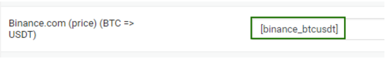

# Конвертация резерва при использовании мерчанта

Предположим, что вы используете автовыплату Binance для выплаты BTC. На аккаунте Binance резерв хранится в USDT. Необходимо сконвертировать значение резерва USDT в актуальный резерв для BTC.

1. В панели управления в разделе "**Мерчанты" → "Автовыплаты"** **→** перейдите в настройки модуля Binance. В нижней части страницы с настройками модуля найдите активную ссылку "**Шорткод для резерва валюты**" и нажмите на неё. Скопируйте шорткод для "**Binance (binance) — USDT**"

<figure><figcaption></figcaption></figure>

2. В панели управления сайтом в разделе "**Парсеры 2.0" → "Курсы источников" →** скопируйте шорткод BTC=>USDT.

<figure><figcaption></figcaption></figure>

3. Перейдите к редактированию валюты BTC. В настройках валюты на вкладке "**Резервы**" для параметра "**Резерв валют**" выберите опцию "**По формуле**".
4.  Чтобы получить актуальный резерв в BTC, резерв в USDT нужно разделить на курс **BTC -> USDT**. Для этого в появившемся ниже поле "**Формула для резерва**" укажите следующую формулу в настройках валюты:\

    <figure><figcaption></figcaption></figure>

где **\[binance\_usdt]** — это шорткод, который был скопирован из настроек модуля автовыплат "Binance", а **\[parser\_binance\_btcusdt]** — это шорткод, который был скопирован в разделе "**Парсер 2.0**" и в который был добавлен параметр **parser\_**.

Аналогичным образом можно настроить конвертируемый резерв для других валют.
