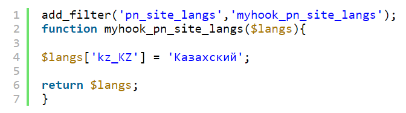

# Добавление нового языка

По умолчанию Premium Exchanger имеет только 2 языка: русский и английский.

Также вы можете добавить новые языки:

Добавьте корректный фильтр в плагин хуков в конце файла `wp-content/plugins/premiumhook/premiumhook.php`. В разделе "**Плагины**" активируйте плагин "**Premium Exchanger hooks**":

<figure><figcaption></figcaption></figure>

Данные добавляются согласно стандарту [ISO 3166-1](https://ru.wikipedia.org/wiki/ISO_3166-1).

После добавления языка через фильтр в панели администратора появятся дополнительные поля для ввода. Но это ещё не всё — наш плагин, наша тема и WordPress пока что не понимают нового языка и весь текст будет на английском (по умолчанию).

Необходимо скачать программу перевода [Poedit](https://poedit.net/download).\
Программа имеет два режима – платный и бесплатный. В нашем случае подходит любой режим, но платная версия программы позволяет автоматически перевести все строки из файла.

### Локализация для WordPress (базовые опции WordPress)

1. С помощью любой поисковой системы найдите необходимый WordPress, к примеру, с помощью запроса "Wordpress на казахском". Скачайте подходящий дистрибутив.
2. В скачанном дистрибутиве откройте папку `wp-content/languages/` и скопируйте из неё файлы локализации на ваш сайт.

Это файлы с префиксом — к примеру, в казахской версии, это:

* `kk_KZ.po`
* `kk_KZ.mo`
* `kk_KZ.php`

### Локализация темы Premium Exchanger (клиентская часть сайта)

1. Откройте папку темы: `wp-content/themes/имя_вашей_темы/lang/`_._
2. Скачайте файлы `ru_RU.po` и `ru_RU.mo`, после скачивания измените названия на свой префикс. В итоге у вас должны быть файлы `kk_KZ.po` и `kk_KZ.mo`.
3. Откройте файл `kk_KZ.po` в программе Poedit.
4. Нажмите на необходимую для перевода строку. Слева будет отображаться оригинальный английский текст, а справа текст, который будет в вашей языковой версии.
5. После манипуляций с файлом сохраните файл и загрузите его в вышеуказанную папку. Теперь ваша тема локализована.

### Локализация плагина Premium Exchanger (панель администратора)

1. Откройте папку плагина: `wp-content/plugins/premiumbox/languages/`_._
2. Скачайте файлы `pn-ru_RU.po` и `pn-ru_RU.mo`, после скачивания измените названия на свой префикс. В итоге у вас должны быть файлы `pn-kk_KZ.po` и `pn-kk_KZ.mo`.
3. Откройте файл `pn-kk_KZ.po` в программе Poedit.
4. Нажмите на необходимую для перевода строку. Слева будет отображаться оригинальный английский текст, а справа текст, который будет в вашей языковой версии.
5. После манипуляций с файлом сохраните файл и загрузите его в вышеуказанную папку. Теперь плагин также локализован.

### Локализация фреймворка Premium Exchanger (панель администратора)

1. Откройте папку фреймворка: `wp-content/plugins/premiumbox/premium/languages/`_._
2. Скачайте файлы `pn-ru_RU.po` и `pn-ru_RU.mo`, после скачивания измените название на свой префикс. В итоге у вас должны быть файлы `pn-kk_KZ.po` и `pn-kk_KZ.mo`.
3. Откройте файл `pn-kk_KZ.po` в программе Poedit.
4. Нажмите на необходимую для перевода строку. Слева будет отображаться оригинальный английский текст, а справа текст, который будет в вашей языковой версии.
5. После манипуляций с файлом сохраните файл и загрузите его в вышеуказанную папку. Теперь фреймворк также локализован.

После всех действий добавьте иконку флага с нужным префиксом — `kk_KZ.png` (обязательно в формате **.png**) в раздел плагина `wp-content/plugins/premiumbox/flags/.`


После добавления новых языков обязательно проверьте, что активирован плагин **Premium Exchanger hooks** в разделе **"Плагины"** или активируйте его, если он был отключен.\
.png>)

