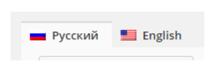
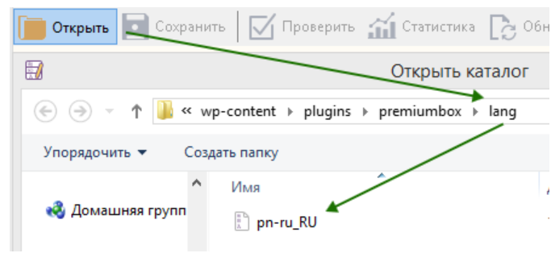
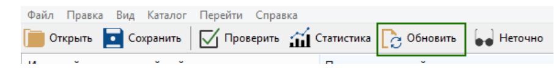
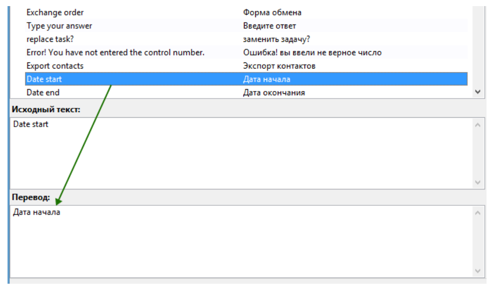

# Редактирование перевода и изменение текста

По умолчанию сайт имеет локализацию на английском и русском языках. Основной язык сайта — английский. Языковые настройки вы найдете в панели управления сайтом в разделе "**Настройки"** → "**Настройки языка"**.

<figure><figcaption></figcaption></figure>

В панели управления сайтом вы можете увидеть такие вкладки:

<figure><figcaption></figcaption></figure>

Переключаясь между вкладками, вы можете добавлять текст для русской и английской версий сайта соответственно. Таким способом, вы можете отредактировать или добавить основную часть контента.

Некоторая часть контента сайта на английском языке, т.к. он это основной язык и находится непосредственно в коде самого сайта. Эта же часть контента сайта, но на русском языке, находится в специальных языковых файлах. Чтобы отредактировать часть контента в коде сайта, вам необходимо:

1\. С помощью FTP-клиента или встроенного файлового менеджере на хостинге скачайте на компьютер папку `wp-content/plugins/premiumbox/`_._

2\. Скачайте программу [Poedit](https://poedit.net/download), установите и запустите её.

3\. В программе Poedit откройте файл `pn-ru_RU.po`, который находится в скачанной папке `wp-content/plugins/premiumbox/languages/`.

<figure><figcaption></figcaption></figure>

4\. В программе Poedit нажмите кнопку "**Обновить"**.

<figure><figcaption></figcaption></figure>

5\. В левой части программы вы найдете исходный текст на английском языке, а в правой  части программы перевод на русском языке. С помощью функции поиска ("**Правка" → "Найти"** или **CTRL+F**) выполните поиск нужного текста на английском или русском языках. Замените необходимый текст перевода на свой (исходный текст <mark style="color:red;">не редактируйте!</mark>).

Нажмите на кнопку "**Сохранить**" после окончания редактирования файла.

<figure><figcaption></figcaption></figure>

6\. С помощью FTP-клиента или встроенного файлового менеджере загрузите с вашего компьютера на хостинг папку `wp-content/plugins/premiumbox/` (с заменой файлов)_._

7\. Аналогичные действия нужно выполнить для других файлов:

* для редактирования перевода дизайна —`wp-content/themes/exchanger/lang/`
* для редактирования перевода фреймворка Premium Exchanger — `wp-content/plugins/premiumbox/premium/languages/`_._

## Изменение текста на английском языке

<figure><figcaption></figcaption></figure>

1. Правой кнопкой мыши нажмите на текст, который нужно изменить. Вы увидите связи с файлами и номера строк файлов скрипта, в которых встречается данный текст.
2. С помощью редактора [Notepad++](https://notepad-plus-plus.org/downloads/) откройте указанные файлы (кодировка UTF-8 без BOM) на вашем компьютере.
3. Перейдите к указанной строке в файле и отредактируйте текст на английском языке. Измененный текст должен быть указан **только на английском языке**, другие языке не допускаются. Сохраните ваши изменения.
4. Вернитесь к программе Poedit и нажмите кнопку "**Обновить"**.
5. С помощью функции поиска найдите текст на английском языке, который вы только что отредактировали в файле.
6. Укажите перевод текста на русском языке в специальном поле. Нажмите кнопку "**Сохранить"**.
7. С помощью FTP-клиента или встроенного файлового менеджере загрузите с вашего компьютера на хостинг папку `wp-content/plugins/premiumbox/` (с заменой файлов)_._
