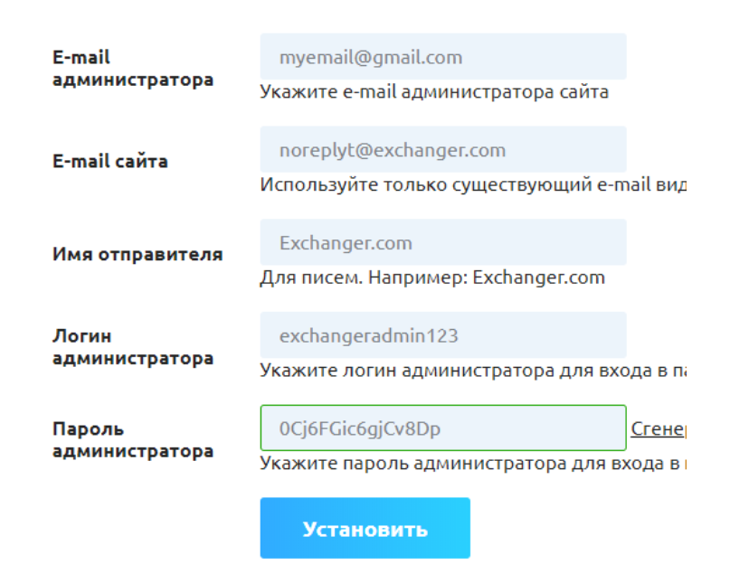

# Инструкция по установке скрипта


Изображения, приведенные в инструкции, могут отличаться от тех, которые будут использоваться в вашей персональной системе.

Здесь и далее по тексту, заменяйте "**ваш\_домен**" на прямой адрес вашего сайта (например, если адрес вашего сайта **premiumexchanger.com**, то вам следует заменить "**ваш\_домен**" на **premiumexchanger.com**).



Обращаем ваше внимание, что **все** файлы должны загружаться под <mark style="color:green;">пользователем, созданным для сайта</mark> (не <mark style="color:red;">root</mark>). Загрузка файлов под <mark style="color:red;">root-пользователем</mark> приведет к нестабильной работе сайта.

Если же вы уже загрузили файлы под root-пользователем, вам нужно сделать следующие действия:

1. Сделать бэкап всех файлов на сервере
2. [Скачать с нашего сайта](https://premiumexchanger.com/uscripts/) дистрибутив для ОБНОВЛЕНИЯ под вашу версию скрипта (как правило это версия 2.7) и вашу версию PHP

3. Загрузить его в корневую папку сайта и распаковать архив с заменой файлов


## Рекомендуемые настройки безопасности и системные требования сервера 

Рекомендуем выполнить перечисленные ниже настройки сервера, чтобы снизить риски взлома сервера, где расположен ваш сайт:

* Обновить модуль [Ioncube Loader](https://www.ioncube.com/loaders.php) до последней версии;
* Установить на сервер модуль [fail2ban](https://github.com/fail2ban/fail2ban);
* Установить на сервер антивирус;
* Заблокировать порты для FTP, SSH и различных Shell-клиентов;
* Заблокировать стандартные адреса к форме авторизация сервера. Например, для ISP Manager это:\
  `https://ip_адрес/manager/`, `https://ip_адрес/manager/ispmngr/`, `https://ip_адрес/ispmngr/`
* Изменить стандартный порт к форме авторизации сервера. Для ISP Manager обычно используется порт 1500. Установить любое свободное значение порта;
* Заблокировать адрес доступа к phpmyadmin и порт;
* Заблокировать адрес доступа к почтовым клиентам. Например,\
  • `https://ip_адрес/webmail/`, `https://ip_адрес/roundcube/` и тому подобные
* Для всех пользователей сервера, в том числе root, установить пароль не менее 15-25 символов.

#### Системные требования к серверу:

* PHP 8.1/8.2/8.3;
* MySQL 5.0 и выше;
* IonCube Loader 13.0 и выше;
* Планировщик задач (cron);
* Требуемые дополнительные PHP-функции, расширения и библиотеки: iconv, mb, curl, gd, openssl, soap, gmpobject, ziparchive.

## Установка основного продукта на сервер 

**1. Загрузка файлов**


Повторно обращаем ваше внимание, что файлы сайта **всегда** должны загружаться из-под <mark style="color:green;">пользователя, созданного для сайта</mark>, а не под <mark style="color:red;">root-пользователем</mark>


В личном кабинете в разделе "[**Ваши скрипты**](https://premiumexchanger.com/uscripts/)" скачайте соответствующую сборку скрипта в зависимости от той версии PHP, которая установлена у вас на сервере. Если вы не знаете какая версия установлена на вашем сервере — обратитесь в техническую поддержку хостинга с этим вопросом.

<figure><figcaption>
Дистрибутив скрипта уже содержит все доступные мерчанты и модули. Отдельная установка мерчантов и модулей не требуется.
</figcaption></figure>

Скачанный архив или его содержимое необходимо загрузить на сервер. Загрузку следует производить в корневую папку сайта (как правило, это папки `public_html, www` или `docs`). Воспользуйтесь встроенным в панель управления файловым менеджером. Либо используйте FTP-клиент для загрузки файлов: Total Commander, CuteFTP и другие. У FTP-клиента должен быть включен бинарный режим передачи файлов (как правило, этот режим установлен по умолчанию).

**2. Генерация лицензии**

В разделе "[**Ваши лицензии**](https://premiumexchanger.com/ulicense/)" необходимо скачать архив с файлами лицензии `license.zip`. Для этого укажите имя вашего домена (при необходимости также укажите имя поддомена), где будет установлен скрипт и нажмите кнопку "**Сохранить**". Затем нажмите на кнопку "**Скачать для версии Х.Х**". Скачанный архив `license.zip` загрузите в корневую папку вашего сайта (как правило, это папки `public_html, www` или `docs`) и распакуйте архив.

<figure><figcaption></figcaption></figure>


<mark style="color:red;">Если имя домена для лицензии не указано и не сохранено, то скачать архив с файлами лицензии нельзя.</mark> <mark style="color:red;">**Будьте внимательны**</mark> <mark style="color:red;">при указании имени домена, чтобы не допустить ошибку. Изменить, переделать или заменить лицензию на другой домен невозможно. Вам потребуется дополнительная лицензия на второй домен.</mark>


Файлы лицензии отвечают за работоспособность скрипта, поэтому нужно соблюдать следующие правила:

* Файлы лицензии нельзя переименовывать. Используйте их с теми именами, с которыми вы их скачали.
* Файлы лицензии должны находиться в корневой папке сайта (как правило, это папки `public_html, www` или `docs`).
* Права на файлы лицензии должны иметь значение 644.
* Содержимое файлов лицензии должно оставаться неизменным.

**3. Создание базы данных**

В панели управления сервером (к примеру, isp manager) найдите раздел "**Базы данных**" и создайте новую базу данных. Введите имя базы данных, имя пользователя базы данных и сгенерируйте сложный пароль:

<figure><figcaption></figcaption></figure>

Запомните или запишите эти данные, они будут необходимы вам в дальнейшем.

**4. Инсталляция**

В адресную строку вашего браузера вставьте следующую ссылку:

`https://ваш_домен/installer/`, перейдите по ней и следуйте инструкциям:

4.1. Выберите язык установки.

<figure><figcaption></figcaption></figure>

4.2. Проверьте основные системные требования вашего сервера. Если какой-то из параметров не соответствует требованиям, вы увидите предупреждение об этом. Нажмите "**Пропустить**", если проверка не выявила ошибок. Если ошибки были выявлены — исправьте их и запустите процесс установки заново.

<figure><figcaption></figcaption></figure>

4.3. Проверьте функции и библиотеки PHP вашего сервера. Если какой-то из параметров не соответствует требованиям, вы увидите предупреждение об этом. Нажмите "**Пропустить**", если проверка не выявила ошибок. Если ошибки были выявлены — исправьте их и запустите процесс установки заново.

<figure><figcaption></figcaption></figure>

4.4. Проверьте разрешение на запись некоторых файлов и папок. Если какой-то из параметров не соответствует требованиям, вы увидите предупреждение об этом. Нажмите "**Пропустить**", если проверка не выявила ошибок. Если ошибки были выявлены — исправьте их и запустите процесс установки заново.

<figure><figcaption></figcaption></figure>

4.5. Заполните имя базы данных, имя пользователя базы данных и пароль, которые вы указали в пункте 3. Нажмите кнопку "**Обновить конфиг**".

<figure><figcaption></figcaption></figure>

4.6. Нажмите кнопку "**Выберите файл**" и выберите файл `damp_db.sql`. Файлы находятся в корне скачанного архива у вас на компьютере. Укажите [полный адрес сайта](#user-content-fn-1)[^1]. Нажмите кнопку "**Импортировать**".

<figure><figcaption></figcaption></figure>

Если система не может выполнить импорт файла базы данных и отображает ошибку, то выполните импорт файла базы данных вручную через phpmyadmin, который есть на вашем сервере. Затем в базе данных в таблице `pr_options` для значений `home` и `siteurl` укажите полное имя вашего сайта.

4.7. Укажите личную электронную почту администратора сайта, электронную почту сайта (создайте соответствующий почтовый ящик на сервере), имя отправителя (обычно это название сайта), а также задайте логин и пароль администратора для входа в панель управления. Нажмите кнопку "**Установить**".

<figure><figcaption></figcaption></figure>

4.8. Выберите язык сайта и панели управления.

<figure><figcaption></figcaption></figure>

4.9. **Обязательно удалите файлы установщика!** На последнем шаге установки перейдите по ссылке: "**Внимание! Нажмите здесь, чтобы удалить файлы установщика**".\
\
**Установка скрипта завершена.**

5\. Панель управления сайтом 

<figure><figcaption></figcaption></figure>

**Адрес панели управления по умолчанию:** `https://ваш_домен/prmmxchngr/`

Используйте логин и пароль, которые были указаны при установке.


Для использования двухфакторной аутентификации (2FA) при авторизации в админ-панели [настройте отправку кодов по удобному вам каналу связи](https://premium.gitbook.io/main/osnovnye-nastroiki/nastroiki/administratory-i-polzovateli/dvukhfaktornaya-avtorizaciya-2fa-v-paneli-upravleniya-saitom) (на e-mail, в Телеграм, через SMS или [через приложение для работы с 2FA](https://premium.gitbook.io/main/osnovnye-nastroiki/nastroiki/administratory-i-polzovateli/dvukhfaktornaya-avtorizaciya-2fa-v-paneli-upravleniya-saitom#id-2fa-s-ispolzovaniem-prilozheniya)).


## Установка дополнительных модулей 


Дистрибутив скрипта "из коробки" уже содержит все доступные мерчанты и модули. Отдельная установка мерчантов и модулей не требуется.


**1. Модули мерчантов на прием**

1.1. В личном кабинете в разделе "[**Ваши скрипты**](https://premiumexchanger.com/uscripts/)" в блоке "**Дополнительные модули**" скачайте модуль мерчанта на прием для требуемой платежной системы.

1.2. Содержимое скачанного архива загрузите на сервер в директорию `ваш_домен/wp-content/plugins/premiumbox/merchants.`

Далее настройте модуль в соответствии с инструкциями, которые описаны в [руководстве пользователя](https://premium.gitbook.io/rukovodstvo-polzovatelya/navigaciya/merchanty-i-vyplaty).

**2. Модули автовыплат**

2.1. В личном кабинете в разделе "[**Ваши скрипты**](https://premiumexchanger.com/uscripts/)" в блоке "**Дополнительные модули**" скачайте модуль автовыплаты для требуемой платежной системы.

2.2. Содержимое скачанного архива загрузите на сервер в директорию `ваш_домен/wp-content/plugins/premiumbox/paymerchants`.

Далее настройте модуль в соответствии с инструкциями, которые описаны в [руководстве пользователя](https://premium.gitbook.io/rukovodstvo-polzovatelya/navigaciya/merchanty-i-vyplaty/vyplaty).

[^1]: кириллический домен должен быть указан в формате `xn--90aiufb.xn--p1ai`
